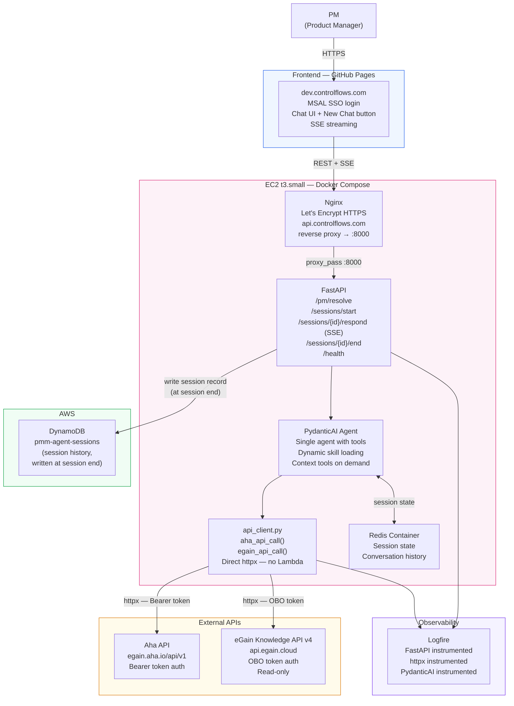
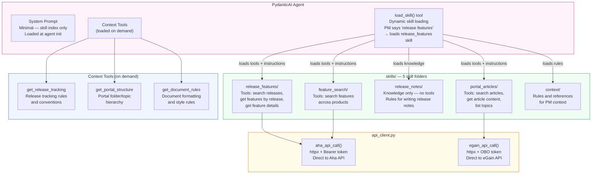
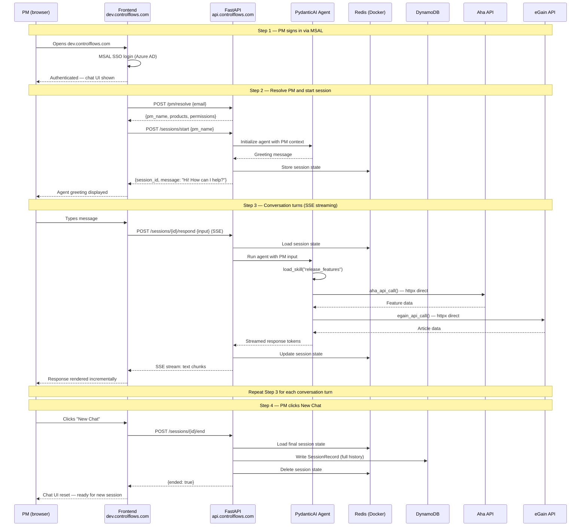
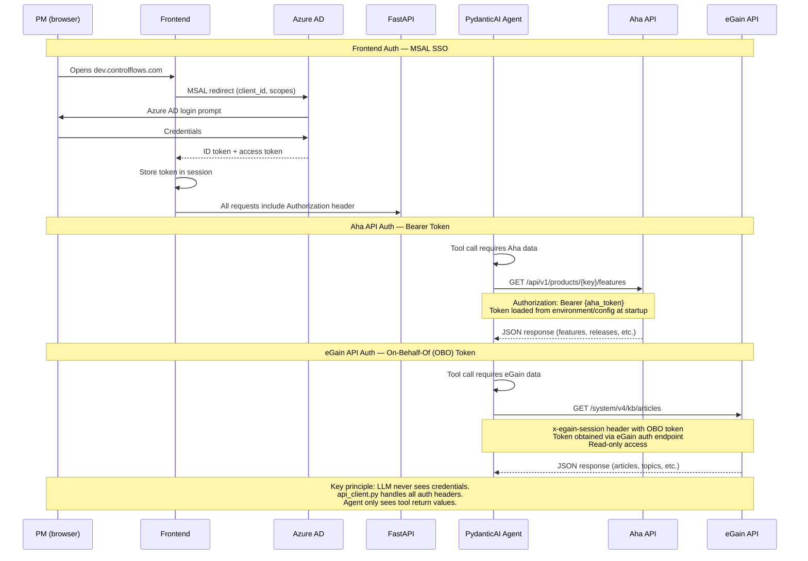
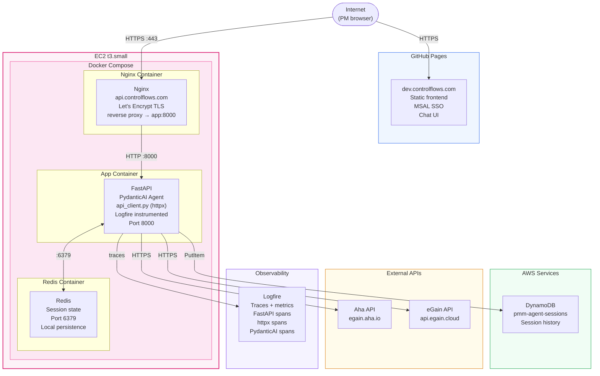

# PMM AI Agent — Architecture Diagrams

**Version:** 3.0
**Last updated:** March 2026
**Related docs:** `REPO.md` · `pmm-ai-agent-implementation-guide.md`

All diagrams use Mermaid. Render in GitHub, VS Code (Mermaid extension), or any Mermaid-compatible viewer.

---

## 1. System Overview

High-level picture of all components, data flow, and external integrations.

---

## 2. Agent Tool Architecture

Single PydanticAI Agent with dynamic skill loading and context tools.

---

## 3. Session Lifecycle

Sequence diagram showing the full lifecycle of a PM session from login to end.

---

## 4. Auth Flow

How authentication works for each component in the system.

---

## 5. Deployment Architecture

EC2 instance with Docker Compose, Nginx reverse proxy, and supporting services.

---

## Diagram Index

| # | Diagram | What it shows |
|---|---|---|
| 1 | System Overview | All components: GitHub Pages frontend, EC2 + Docker backend, direct API calls to Aha/eGain, Redis, DynamoDB, Logfire |
| 2 | Agent Tool Architecture | Single PydanticAI Agent with dynamic skill loading (5 skill folders), context tools, and direct httpx API client |
| 3 | Session Lifecycle | Full sequence: MSAL login, /pm/resolve, /sessions/start, SSE streaming via /sessions/{id}/respond, /sessions/{id}/end |
| 4 | Auth Flow | MSAL SSO for frontend, Bearer token for Aha, OBO token for eGain — LLM never sees credentials |
| 5 | Deployment Architecture | EC2 t3.small with Docker Compose (Nginx + App + Redis), Nginx + Let's Encrypt for HTTPS |
