# PMM AI Agent — Architecture Diagrams

**Version:** 2.0  
**Last updated:** March 2026  
**Related docs:** `REPO.md` · `pmm-ai-agent-implementation-guide.md`

All diagrams use Mermaid. Render in GitHub, VS Code (Mermaid extension), or any Mermaid-compatible viewer.

---

## 1. System Overview

High-level picture of all components, who calls what, and where data lives.

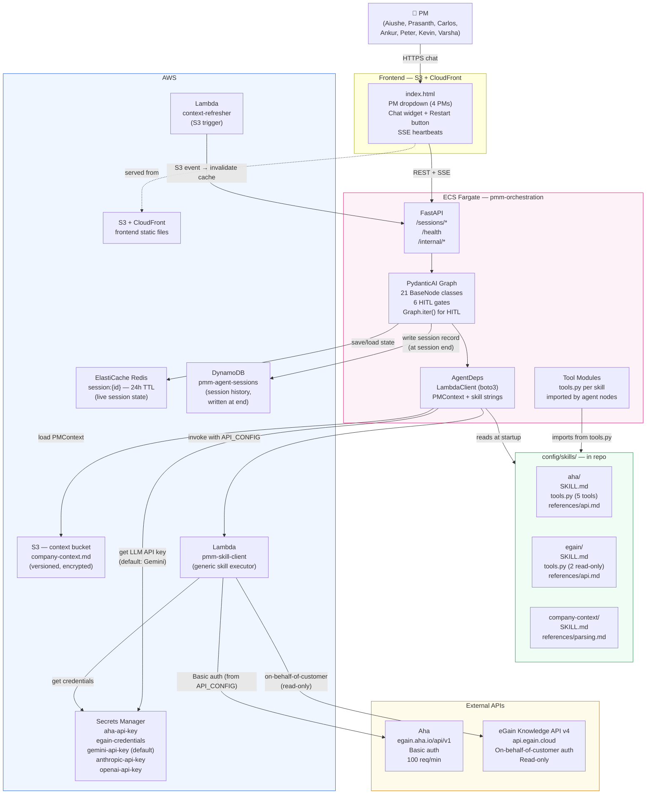

---

## 2. PydanticAI Graph — Full Node Flow

Complete state machine showing every node, HITL gates, and routing decisions.

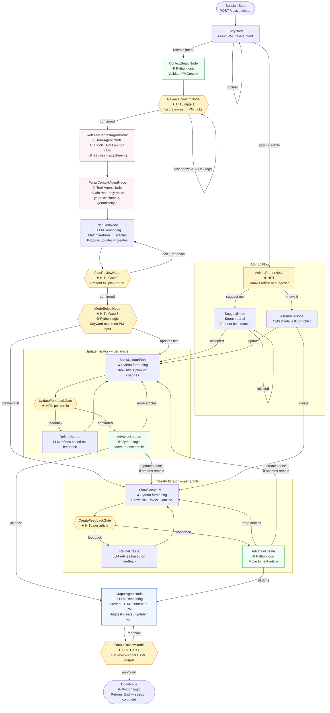

---

## 3. Skill Folder Architecture

How the Anthropic skills standard maps to this project.

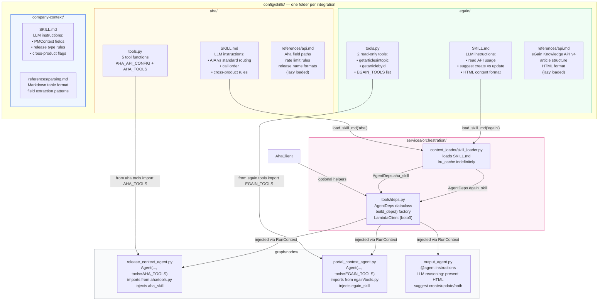

---

## 4. Concurrent Session Model

How multiple PMs can use the service simultaneously with full isolation. Skill scripts run as stateless Lambdas — no process-level singletons.

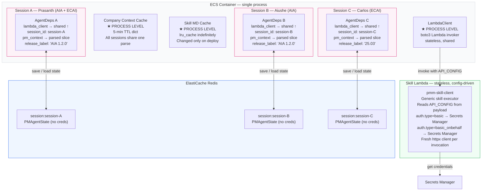

---

## 5. Auth and Credential Flow

How credentials travel from AWS Secrets Manager into API calls — and what the LLM never sees.

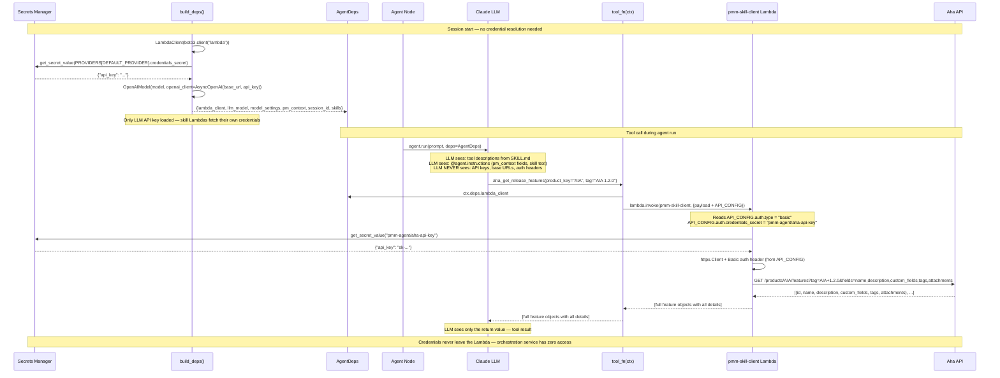

---

## 6. HITL Session Lifecycle

How a multi-turn conversation persists across HTTP requests.

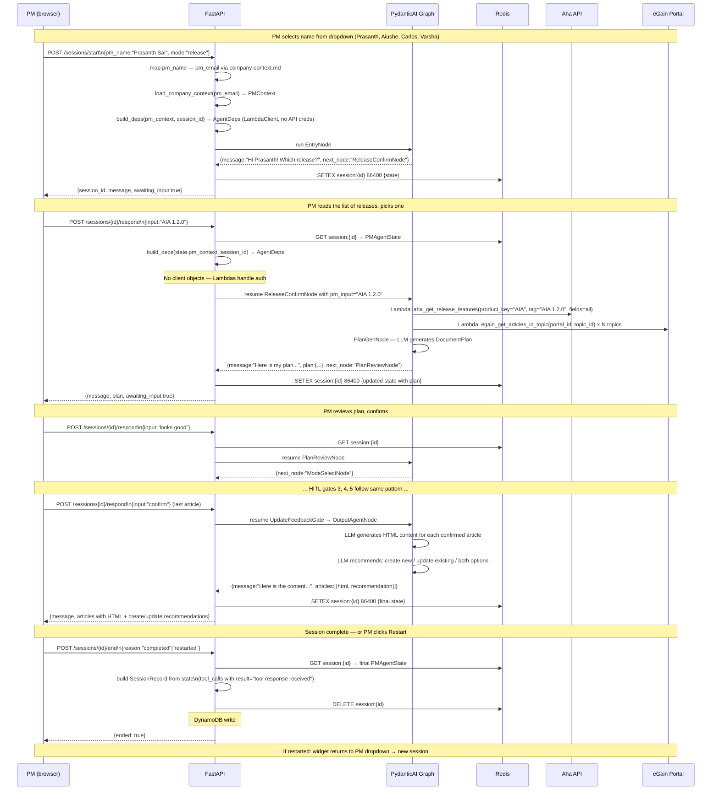

---

## 7. AWS Infrastructure

Network topology and resource placement.

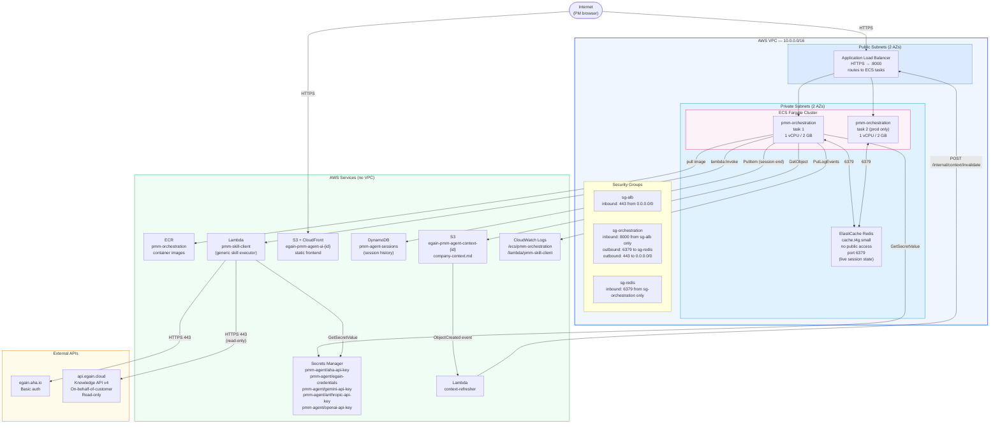

---

## 8. Data Model Relationships

How the core Pydantic models relate to each other and to Redis.

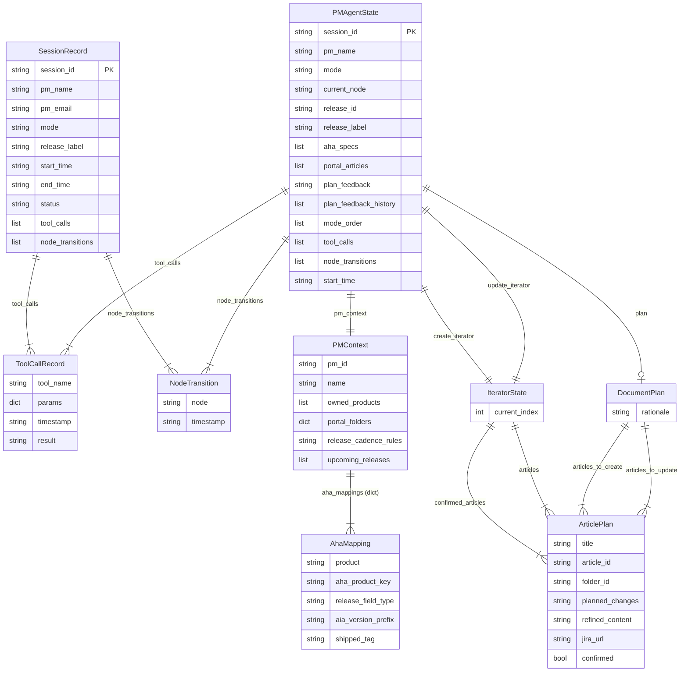

---

## 9. AIA vs Standard Release — Decision Flow

How the agent determines which Aha fetch strategy to use for each PM.

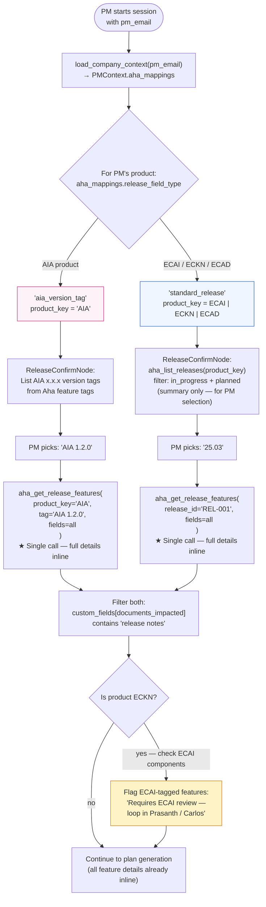

---

## 10. Deployment Pipeline

CI/CD flow from branch to production.

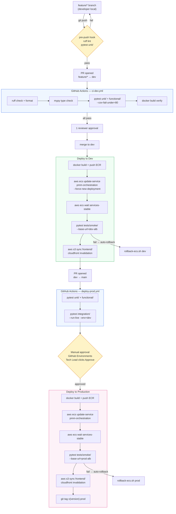

---

---

## 11. Skill Script Execution Model — All Scripts Run as Lambdas

This diagram answers: **"The skill has scripts — how do they execute?"**

Short answer: **All skill scripts are deployed as Lambda functions.** The orchestration service invokes them via `boto3 lambda.invoke`. Each invocation is stateless — no connection pools, no rate limiters, no in-process token caching.

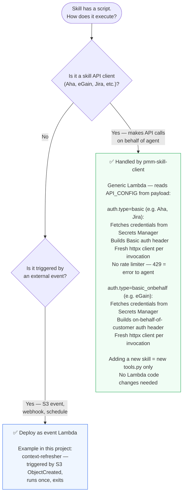

### Why all skill scripts run as Lambdas

| Property | Lambda approach | Trade-off |
|---|---|---|
| **Single generic Lambda** | One `pmm-skill-client` handles all skills — auth is config-driven from `tools.py` | Adding a new skill requires zero Lambda code changes |
| **No connection pool management** | Each invocation creates a fresh httpx client and discards it | Slightly higher latency per call (~50-200ms overhead) |
| **No process singletons** | No client objects in the ECS process | Simpler ECS service — fewer failure modes |
| **No shared rate limiter** | If Aha returns 429, the Lambda propagates the error | Concurrent PMs could hit the 100 req/min limit; agent surfaces the error to the PM |
| **Config-driven auth** | `API_CONFIG` from `tools.py` tells the Lambda how to authenticate (basic, basic_onbehalf) | New auth types require Lambda code changes, but new skills with existing auth types do not |
| **Credentials isolated** | Lambda fetches credentials from Secrets Manager using `credentials_secret` from payload | Orchestration service never touches API keys — better security boundary |

### Current Lambda inventory

| Lambda | Trigger | Purpose |
|---|---|---|
| `pmm-skill-client` | `boto3 lambda.invoke` from orchestration service | Generic skill executor — reads `API_CONFIG` from payload, authenticates per `auth.type`, makes API call, returns result |
| `pmm-context-refresher` | S3 `ObjectCreated` on `context/` | Calls `POST /internal/context/invalidate` on orchestration service |

---

## Diagram Index

| # | Diagram | What it shows |
|---|---|---|
| 1 | System Overview | All components and who calls what |
| 2 | Graph Node Flow | Complete PydanticAI Graph with all 21 BaseNode classes, 6 HITL gates, and Graph.iter() for HITL pause/resume |
| 3 | Skill Folder Architecture | How SKILL.md + tools.py + scripts/ wire together |
| 4 | Concurrent Session Model | Lambda-based stateless clients, per-session isolation via Redis |
| 5 | Auth and Credential Flow | Sequence: tool call → Lambda → Secrets Manager → API (LLM and ECS never see creds) |
| 6 | HITL Session Lifecycle | Full multi-turn conversation across 3 HTTP requests |
| 7 | AWS Infrastructure | Network topology, security groups, resource placement |
| 8 | Data Model Relationships | ER diagram: PMAgentState, PMContext, DocumentPlan, IteratorState |
| 9 | AIA vs Standard Release | Decision tree for AIA version-tag vs standard release fetch strategy |
| 10 | Deployment Pipeline | CI/CD from branch → dev → prod with approval gates |
| 11 | Script Execution Model | Single generic Lambda (`pmm-skill-client`), config-driven auth from tools.py |
