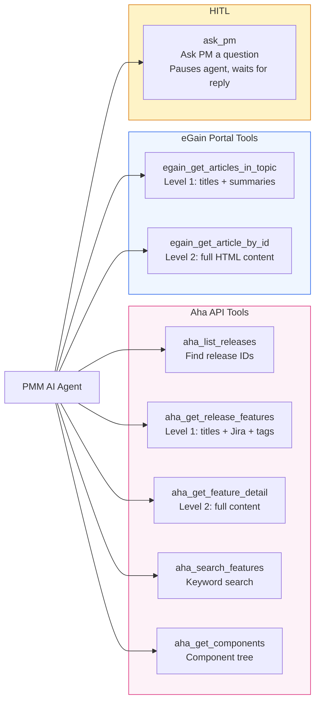
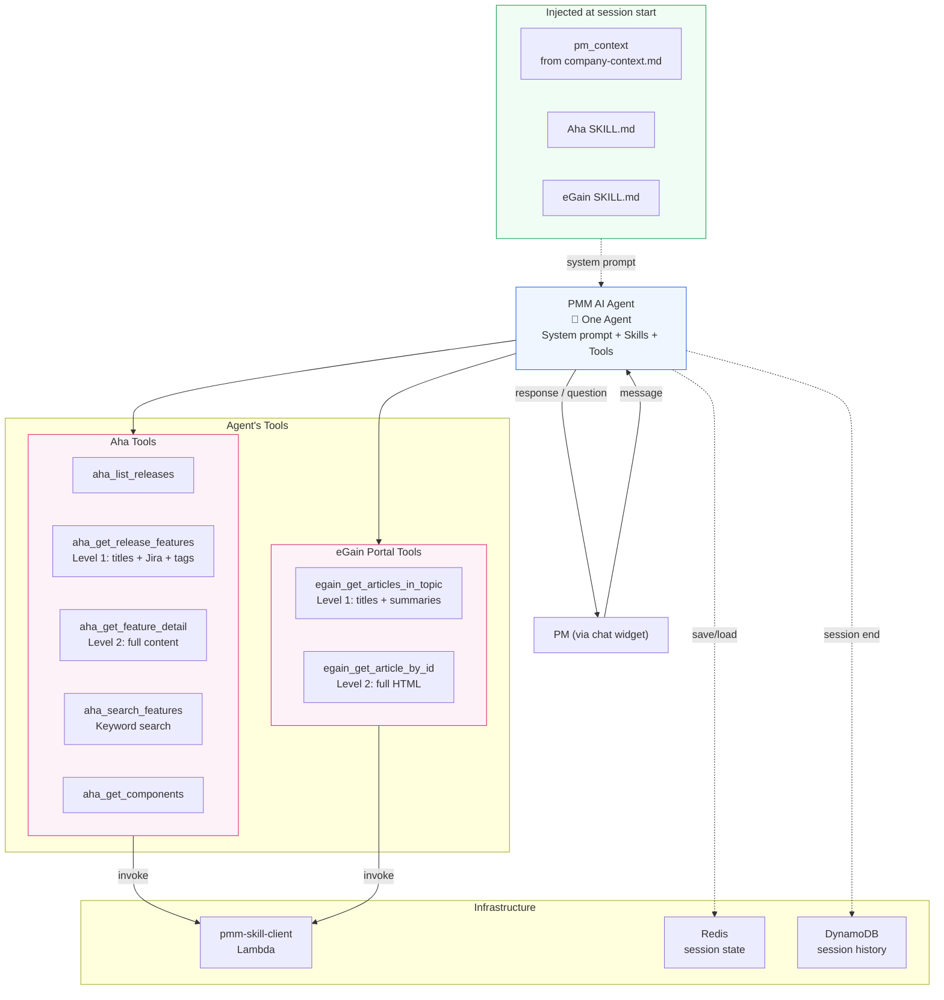

# PMM AI Agent — Implementation Guide

**Project:** eGain Product Marketing Manager (PMM) AI Agent  
**Version:** 2.0  
**Document type:** Sequential build guide — follow steps top to bottom  
**Architecture reference:** `pmm-ai-agent-architecture.md`  
**Repository map:** `REPO.md` — read before navigating any file in the codebase

---

## How to use this guide

Every step in this guide is executable in order. Each step has:

- **What you're building** — one concrete artifact (a file, a command, a running service)
- **The exact commands or code** — copy-paste ready
- **A checkpoint** — what to verify before moving to the next step

Do not skip a checkpoint. If it fails, fix it before continuing — later steps assume earlier ones are working.

**Time estimate per section:**

| Section | Time |
|---|---|
| Section 0 — Prerequisites | 1–2 hours (mostly waiting for AWS provisioning) |
| Section 1 — Repository scaffold | 20 minutes |
| Section 2 — AWS infrastructure | 1–2 hours |
| Section 3 — Skill folders | 2–3 hours |
| Section 4 — Core service code | 4–6 hours |
| Section 5 — Graph nodes | 4–8 hours |
| Section 6 — FastAPI layer | 1–2 hours |
| Section 7 — Dockerfile + Lambda | 1 hour |
| Section 8 — Test suite | 2–3 hours |
| Section 9 — Deploy to dev | 1–2 hours |
| Section 9b — Observability | 30 minutes |
| Section 10 — Frontend | 1 hour |
| Section 11 — CI/CD and production | 30 minutes |
| Section 14 — Extension guide | reference |

---

## Section 0 — Prerequisites

Before writing a single line of code, verify you have everything below. Attempting to build without these in place means hitting blockers mid-build.

### Step 0.1 — Local machine requirements

Install the following tools and verify each version:

```bash
# Python 3.11 or higher
python3 --version            # must show 3.11.x or 3.12.x

# Docker Desktop
docker --version             # must show 24.x or higher
docker compose version       # must show v2.x

# AWS CLI v2
aws --version                # must show aws-cli/2.x

# Terraform
terraform -version           # must show 1.7 or higher

# uv (fast Python package manager)
uv --version                 # must show 0.4 or higher
# Install if missing:
curl -LsSf https://astral.sh/uv/install.sh | sh

# Git
git --version
```

**Checkpoint 0.1:** All six commands return version numbers without errors.

---

### Step 0.2 — AWS account setup

You need an AWS account with an IAM user or role that has the following permissions. Create a dedicated IAM user named `pmm-agent-deployer` rather than using root credentials.

**Required IAM permissions:**

```json
{
  "Version": "2012-10-17",
  "Statement": [
    {
      "Effect": "Allow",
      "Action": [
        "ecr:*",
        "ecs:*",
        "ec2:*",
        "elasticache:*",
        "s3:*",
        "secretsmanager:*",
        "logs:*",
        "iam:CreateRole",
        "iam:AttachRolePolicy",
        "iam:PassRole",
        "lambda:*",
        "cloudfront:*"
      ],
      "Resource": "*"
    }
  ]
}
```

Configure the CLI profile:

```bash
aws configure --profile pmm-agent-dev
# Enter: Access Key ID, Secret Access Key, region (us-west-2), output format (json)

# Verify it works
aws sts get-caller-identity --profile pmm-agent-dev
# Should return your account ID and IAM user ARN
```

**Checkpoint 0.2:** `aws sts get-caller-identity` returns your account ID. Note the account ID — you'll need it in Step 2.

---

### Step 0.3 — External API access

Before any code can run, you need these credentials. Get them from the respective systems and have them ready — they get stored in AWS Secrets Manager in Step 2.

**1. Gemini API key (primary LLM provider):**
- Go to `aistudio.google.com` → Get API Key → Create API key
- Model: `gemini-3-flash-preview` with `reasoning_effort: "low"` (configured in `settings.py`)
- Note down the API key

**2. Anthropic API key (secondary LLM provider):**
- Go to `console.anthropic.com` → API Keys → Create Key
- Name it `pmm-agent-prod`
- Model: `claude-sonnet-4-20250514` (used if you switch `DEFAULT_PROVIDER` in `settings.py`)
- Note it down

**3. Aha API key:**
- Log in to `egain.aha.io` → Account Settings → Developer → API Keys
- Create a **service account key** (not your personal key — this runs in production)
- Note it down; you will never see it again after closing the dialog

**4. eGain Knowledge API v4 credentials:**
- Get a `client_id` and `client_secret` for on-behalf-of-customer auth from your eGain admin
- Confirm the base URL of the Knowledge API (e.g. `api.egain.cloud`)
- Verify the service account has read access to portal articles

**5. Aha subdomain:**
- Your Aha URL is `https://egain.aha.io` → subdomain is `egain`

**Checkpoint 0.3:** You have all five values written down (not in any file yet):
- Gemini API key (primary)
- Anthropic API key (secondary)
- Aha API key
- eGain client_id + client_secret
- Aha subdomain (`egain`)

---

## Section 1 — Repository Scaffold

### Step 1.1 — Create the repo

```bash
# Create the repository
mkdir pmm-ai-agent && cd pmm-ai-agent
git init
git checkout -b main

# Create the full directory structure in one command
mkdir -p \
  context \
  config/skills/release-features \
  config/skills/feature-search \
  config/skills/release-notes \
  config/skills/portal-articles \
  config/skills/context \
  config/skills/company-context \
  docs \
  frontend \
  infrastructure/terraform/modules/{networking,redis,s3,secrets,ecs,lambda} \
  infrastructure/scripts \
  infrastructure/git-hooks \
  services/orchestration/context_loader \
  services/orchestration \
  services/orchestration/session \
  services/orchestration/tools \
  lambdas/context-refresher \
  tests/unit/{aha,egain,orchestration,tools,lambdas} \
  tests/functional \
  tests/integration \
  tests/smoke \
  tests/e2e \
  tests/fixtures
```

**Checkpoint 1.1:** `find . -type d | sort` shows all directories. No errors.

---

### Step 1.2 — Create root config files

```bash
# .gitignore
cat > .gitignore << 'EOF'
.env.local
.env.dev
.env.prod
__pycache__/
*.pyc
.pytest_cache/
htmlcov/
.coverage
*.egg-info/
dist/
build/
.terraform/
terraform.tfstate*
*.tfvars
!terraform.tfvars.example
.DS_Store
EOF

# .env.example — committed to repo, safe defaults
cat > .env.example << 'EOF'
APP_ENV=local
LOG_LEVEL=debug

# Redis (local Docker)
REDIS_URL=redis://localhost:6379

# Aha
AHA_SUBDOMAIN=egain
AHA_API_KEY_OVERRIDE=          # set locally to skip Secrets Manager

# eGain (read-only Knowledge API v4)
EGAIN_API_HOST=api.egain.cloud
EGAIN_CLIENT_ID_OVERRIDE=     # set locally to skip Secrets Manager
EGAIN_CLIENT_SECRET_OVERRIDE=  # set locally to skip Secrets Manager

# LLM Providers (set the one matching DEFAULT_PROVIDER in settings.py)
GEMINI_API_KEY=                # default provider — set locally to skip Secrets Manager
CLAUDE_API_KEY=                # Anthropic — set if switching DEFAULT_PROVIDER
OPENAI_API_KEY=                # OpenAI — set if switching DEFAULT_PROVIDER

# AWS
AWS_DEFAULT_REGION=us-west-2
AWS_PROFILE=pmm-agent-dev

# S3 context bucket
CONTEXT_BUCKET=egain-pmm-agent-context-dev

# Frontend
FRONTEND_ORIGIN_DEV=http://localhost:3000
EOF

# Copy and fill in your local values
cp .env.example .env.local
echo "Edit .env.local and add your API keys now"
```

Edit `.env.local` and fill in the four `_OVERRIDE` values you collected in Step 0.3.

```bash
# pyproject.toml
cat > pyproject.toml << 'EOF'
[project]
name = "pmm-ai-agent"
version = "1.0.0"
requires-python = ">=3.11"

[tool.uv.workspace]
members = [
  "services/orchestration",
  "lambdas/context-refresher",
]

[tool.pytest.ini_options]
asyncio_mode = "auto"
testpaths = ["tests"]
markers = [
  "unit: fully mocked, no network",
  "functional: real graph transitions, LLM mocked",
  "integration: real dev APIs, requires --run-live",
  "smoke: post-deploy health checks",
  "e2e: full session flow via HTTP",
]

[tool.ruff]
line-length = 100
target-version = "py311"

[tool.mypy]
python_version = "3.11"
strict = false
EOF
```

```bash
# services/orchestration/requirements.txt
cat > services/orchestration/requirements.txt << 'EOF'
pydantic-ai>=0.1.0
# pydantic-graph not needed — single-agent architecture, no graph
fastapi>=0.115.0
uvicorn[standard]>=0.30.0
redis[asyncio]>=5.0.0
boto3>=1.34.0
httpx>=0.27.0
python-dotenv>=1.0.0
EOF

# services/orchestration/requirements-dev.txt
cat > services/orchestration/requirements-dev.txt << 'EOF'
pytest>=8.0
pytest-asyncio>=0.23
pytest-cov>=5.0
ruff>=0.5.0
mypy>=1.10.0
EOF
```

```bash
# Install everything
cd services/orchestration
uv pip install -r requirements.txt -r requirements-dev.txt
cd ../..
```

**Checkpoint 1.2:** `python -c "import pydantic_ai, fastapi, redis, httpx; print('all imports OK')"` prints successfully.

---

### Step 1.3 — docker-compose for local dev

```yaml
# docker-compose.yml
```

Create `docker-compose.yml` with this content:

```yaml
services:
  orchestration:
    build:
      context: services/orchestration
      dockerfile: Dockerfile
    ports:
      - "8000:8000"
    env_file:
      - .env.local
    environment:
      - REDIS_URL=redis://redis:6379
      - DYNAMODB_ENDPOINT=http://dynamodb:8000
    volumes:
      - ./config:/app/config:ro
      - ./context:/app/context:ro
      - ./prompts:/app/prompts:ro
    depends_on:
      redis:
        condition: service_healthy
      dynamodb:
        condition: service_healthy
    restart: unless-stopped

  redis:
    image: redis:7-alpine
    ports:
      - "6379:6379"
    healthcheck:
      test: ["CMD", "redis-cli", "ping"]
      interval: 5s
      timeout: 3s
      retries: 5

  dynamodb:
    image: amazon/dynamodb-local:latest
    ports:
      - "8042:8000"
    command: "-jar DynamoDBLocal.jar -sharedDb"
    healthcheck:
      test: ["CMD-SHELL", "curl -s http://localhost:8000 || exit 1"]
      interval: 5s
      timeout: 3s
      retries: 5
```

**Local dev services:**

| Service | Port | Purpose |
|---|---|---|
| Redis | `localhost:6379` | Live session state (`PMAgentState`) |
| DynamoDB Local | `localhost:8042` | Session history (written at session end) |
| Orchestration | `localhost:8000` | FastAPI app (started later) |

In production, Redis → ElastiCache, DynamoDB Local → AWS DynamoDB, S3 → real S3 bucket.

**Checkpoint 1.3:** Start both services and verify:

```bash
docker compose up redis dynamodb -d
docker compose ps                    # both show "healthy"
redis-cli ping                       # returns PONG
curl -s http://localhost:8042        # returns "healthy" or JSON
```

---

### Step 1.4 — Install git hooks

```bash
# infrastructure/git-hooks/pre-push
cat > infrastructure/git-hooks/pre-push << 'EOF'
#!/bin/bash
set -e
echo "→ Linting..."
ruff check services/ tests/
echo "→ Unit tests..."
pytest tests/unit/ -q --tb=short
echo "✅ Pre-push checks passed"
EOF

chmod +x infrastructure/git-hooks/pre-push

# Install
cat > infrastructure/scripts/install-hooks.sh << 'EOF'
#!/bin/bash
cp infrastructure/git-hooks/pre-push .git/hooks/pre-push
chmod +x .git/hooks/pre-push
echo "Git hooks installed"
EOF

bash infrastructure/scripts/install-hooks.sh
```

**Checkpoint 1.4:** `cat .git/hooks/pre-push` shows the script content.

---

## Section 2 — AWS Infrastructure

Build AWS infrastructure before writing application code. The app needs the S3 bucket, Redis endpoint, and Secrets Manager ARNs at runtime.

### Step 2.1 — Bootstrap Secrets Manager entries

Create the secret entries now so you can reference their ARNs in all subsequent Terraform config. Set real values immediately — you have them from Step 0.3.

```bash
export AWS_PROFILE=pmm-agent-dev
export AWS_DEFAULT_REGION=us-west-2
ACCOUNT_ID=$(aws sts get-caller-identity --query Account --output text)

# Create secrets (replace placeholders with your real values)
aws secretsmanager create-secret \
  --name "pmm-agent/aha-api-key" \
  --secret-string "{\"api_key\":\"YOUR_AHA_KEY_HERE\"}"

aws secretsmanager create-secret \
  --name "pmm-agent/egain-credentials" \
  --secret-string "{\"client_id\":\"YOUR_EGAIN_CLIENT_ID\",\"client_secret\":\"YOUR_EGAIN_CLIENT_SECRET\"}"

aws secretsmanager create-secret \
  --name "pmm-agent/gemini-api-key" \
  --secret-string "{\"api_key\":\"YOUR_GEMINI_KEY_HERE\"}"

aws secretsmanager create-secret \
  --name "pmm-agent/anthropic-api-key" \
  --secret-string "{\"api_key\":\"YOUR_ANTHROPIC_KEY_HERE\"}"

aws secretsmanager create-secret \
  --name "pmm-agent/openai-api-key" \
  --secret-string "{\"api_key\":\"YOUR_OPENAI_KEY_HERE\"}"

echo "Secrets created. ARNs:"
aws secretsmanager list-secrets --query "SecretList[?starts_with(Name,'pmm-agent')].ARN" --output text
```

**Checkpoint 2.1:** Five secret ARNs printed. Verify in AWS Console → Secrets Manager that all five exist.

---

### Step 2.2 — Provision S3 context bucket

```bash
BUCKET_NAME="egain-pmm-agent-context-${ACCOUNT_ID}"

aws s3api create-bucket \
  --bucket "${BUCKET_NAME}" \
  --region us-west-2

# Enable versioning
aws s3api put-bucket-versioning \
  --bucket "${BUCKET_NAME}" \
  --versioning-configuration Status=Enabled

# Block public access
aws s3api put-public-access-block \
  --bucket "${BUCKET_NAME}" \
  --public-access-block-configuration \
    BlockPublicAcls=true,IgnorePublicAcls=true,BlockPublicPolicy=true,RestrictPublicBuckets=true

# Enable encryption
aws s3api put-bucket-encryption \
  --bucket "${BUCKET_NAME}" \
  --server-side-encryption-configuration \
    '{"Rules":[{"ApplyServerSideEncryptionByDefault":{"SSEAlgorithm":"AES256"}}]}'

echo "S3 bucket: ${BUCKET_NAME}"
# Save this for .env.local
```

Update `.env.local`:
```
CONTEXT_BUCKET=egain-pmm-agent-context-YOURACCOUNTID
```

**Checkpoint 2.2:** `aws s3 ls s3://${BUCKET_NAME}` returns empty (no error). Versioning shows `Enabled`.

---

### Step 2.3 — Provision ECR repository

```bash
aws ecr create-repository \
  --repository-name pmm-orchestration \
  --region us-west-2

ECR_REGISTRY="${ACCOUNT_ID}.dkr.ecr.us-west-2.amazonaws.com"
echo "ECR registry: ${ECR_REGISTRY}/pmm-orchestration"
```

**Checkpoint 2.3:** `aws ecr describe-repositories --repository-names pmm-orchestration` returns the repository URI.

---

### Step 2.4 — Provision Terraform infrastructure (VPC, Redis, ECS)

```bash
# infrastructure/terraform/terraform.tfvars.example
cat > infrastructure/terraform/terraform.tfvars.example << 'EOF'
aws_account_id = "YOUR_ACCOUNT_ID"
aws_region     = "us-west-2"
env            = "dev"
vpc_cidr       = "10.0.0.0/16"
EOF

cp infrastructure/terraform/terraform.tfvars.example infrastructure/terraform/terraform.tfvars
# Edit terraform.tfvars and set your account ID

cd infrastructure/terraform
terraform init

# Provision in dependency order
terraform apply -target=module.networking -auto-approve
terraform apply -target=module.redis -auto-approve
terraform apply -target=module.ecs -auto-approve
terraform apply -target=module.lambda -auto-approve

# Note the outputs
terraform output redis_endpoint
terraform output public_alb_dns_name
terraform output ecs_cluster_name
cd ../..
```

Update `.env.local` with the Redis endpoint:
```
REDIS_URL=redis://REDIS_ENDPOINT_FROM_TERRAFORM:6379
```

**Checkpoint 2.4:** `terraform output` shows `redis_endpoint`, `public_alb_dns_name`, `ecs_cluster_name` without errors. In AWS Console, verify ECS cluster exists and Redis cluster is `available`.

---

## Section 3 — Skills

Skills are organized by **PM capability**, not by API. Each skill teaches the agent how to accomplish a task — it may use tools from any API. This follows Anthropic's skill standard (see `github.com/anthropics/skills`).

```
config/skills/
├── release-features/          ← Fetching + reviewing release features
│   ├── SKILL.md               ← Knowledge: two-level fetch, Documents Impacted rules
│   └── tools.py               ← Tools: fetch_release_features(), get_feature_detail()
│                                  Calls Aha API via Lambda
│
├── feature-search/            ← Finding features by vague name
│   ├── SKILL.md               ← Knowledge: ask for release, show top 7 with links
│   └── tools.py               ← Tools: search_features()
│                                  Calls Aha API via Lambda
│
├── release-notes/             ← Creating release notes for features
│   └── SKILL.md               ← Knowledge: article format, one-at-a-time workflow
│                                  No tools.py — agent generates content with LLM reasoning
│
├── portal-articles/           ← Browsing, comparing, updating, creating portal articles
│   ├── SKILL.md               ← Knowledge: summary-first, create vs update logic, topic hierarchy
│   └── tools.py               ← Tools: browse_portal_topic(), read_portal_article(),
│                                  check_portal_for_release()
│                                  Calls eGain API via Lambda
│
├── context/                   ← Dynamic context loading (NOT dumped into system prompt)
│   └── tools.py               ← Tools: get_pm_context(), get_release_tracking(),
│                                  get_portal_structure(), get_document_rules()
│                                  Reads from company-context.md (local or S3)
│
└── company-context/           ← Format spec for company-context.md (developer reference)
    └── SKILL.md               ← NOT loaded by agent — reference for developers + parser
```

### Skill types

| Type | Has tools.py? | Example | What it does |
|---|---|---|---|
| **Tool skill** | Yes | `release-features/`, `portal-articles/` | SKILL.md teaches when/how to use tools. tools.py calls Lambda. |
| **Knowledge skill** | No | `release-notes/` | SKILL.md teaches the agent a workflow. Agent uses LLM reasoning, no API calls. |
| **Context skill** | Yes | `context/` | tools.py loads context dynamically from company-context.md. Agent calls these as needed. |
| **Reference** | No tools, not loaded | `company-context/` | Developer documentation for the company-context.md format. |

### Dynamic context loading

The system prompt is **minimal** — just the PM name and products. Everything else is loaded by the agent via context tools WHEN it needs it:

```
System prompt (always loaded):
  "You are the PMM AI Agent. PM: Prasanth Sai. Products: AIA, ECAI."

Agent needs release tracking rules:
  → calls get_release_tracking("AIA")
  → gets: "AIA uses version tags, not release IDs..."

Agent needs portal structure:
  → calls get_portal_structure()
  → gets: topic hierarchy with IDs

Agent needs Documents Impacted rules:
  → calls get_document_rules()
  → gets: tag meanings table
```

This saves tokens on every turn. The agent only loads what it needs.

### Lambda architecture

All API tools call ONE shared `pmm-skill-client` Lambda:

```
tools.py function → ctx.deps.lambda_client.invoke_skill_lambda("pmm-skill-client", payload)
                     ↓
                 ONE Lambda → authenticates → makes HTTP request → returns response
```

The Lambda handles auth (basic, on-behalf-of-customer) using credentials from Secrets Manager. The ECS process never sees API keys. Adding a new API = add auth type to Lambda.

### Step 3.1 — Release Features skill

Create `config/skills/release-features/SKILL.md`:

The knowledge file — teaches the agent how to fetch and present release features.
Covers: AIA tags vs release IDs, Documents Impacted rules, two-level fetch pattern,
cross-product dependencies. Business rules (release tracking, Documents Impacted tag
meanings) are loaded dynamically via context tools, NOT hardcoded here.

Create `config/skills/release-features/tools.py`:

Tool functions that call the Aha API via the shared Lambda:
- `fetch_release_features(product_key, release_id?, tag?)` — Level 1: titles + Jira URLs + Documents Impacted tags
- `get_feature_detail(feature_id)` — Level 2: full description + attachments (only after PM confirms)

---

### Step 3.2 — Feature Search skill

Create `config/skills/feature-search/SKILL.md`:

Teaches the agent how to find features by vague name. Workflow: ask PM for release
first to narrow results, search Aha, show top 7 matches with Aha links.

Create `config/skills/feature-search/tools.py`:

- `search_features(product_key, query)` — keyword search in Aha, returns matching features

---

### Step 3.3 — Release Notes skill (knowledge only)

Create `config/skills/release-notes/SKILL.md`:

Pure knowledge — no tools.py. Teaches the agent:
- The release notes article format (Jira Link, Overview, Release Notes, Helpdoc needed, etc.)
- One-at-a-time workflow: generate release notes per feature, PM reviews each
- When to flag Helpdoc updates needed
- Content in Markdown for PM review

---

### Step 3.4 — Portal Articles skill

Create `config/skills/portal-articles/SKILL.md`:

Teaches the agent how to work with the eGain portal. Covers: two-level fetch (summaries
first, full content on demand), create vs update decision logic, topic hierarchy navigation,
"Upcoming Features" vs "New Features" naming, missing article summaries handling.

Create `config/skills/portal-articles/tools.py`:

Tool functions that call the eGain API via the shared Lambda:
- `browse_portal_topic(portal_id, topic_id)` — Level 1: article titles + summaries
- `read_portal_article(portal_id, article_id)` — Level 2: full HTML content
- `check_portal_for_release(portal_id, product, version)` — searches for existing release topic

---

### Step 3.5 — Context skill (dynamic loading)

Create `config/skills/context/tools.py`:

Tools that load context from company-context.md on demand — the agent calls these
WHEN it needs context, not upfront. This keeps the system prompt minimal.

- `get_pm_context(pm_name)` — PM details, owned products, reports-to
- `get_release_tracking(product_key)` — how releases are tracked for this product (tags vs release IDs)
- `get_portal_structure()` — full topic hierarchy with IDs
- `get_document_rules()` — Documents Impacted tag meanings and contradiction rules

These read from `context/company-context.md` (local in dev, S3 in prod).

---

### Step 3.6 — Company Context reference

Create `config/skills/company-context/SKILL.md`:

Developer reference — format specification for company-context.md. NOT loaded by the
agent. Documents the expected Markdown table structure so developers and the parser
stay in sync.

---

### Step 3.7 — System prompt

Create `prompts/system.txt`:

The main agent system prompt. Kept MINIMAL — just PM name, products, and a brief
description of available skills. All context (release tracking, portal structure,
Documents Impacted rules) is loaded dynamically by the agent via context tools.

---

**Checkpoint 3.7:** `ls config/skills/` shows five folders: `release-features/`, `feature-search/`,
`release-notes/`, `portal-articles/`, `context/`, plus `company-context/` (developer reference).

---

## Section 4 — Core Service Code

Now write the Python service layer. Build in this order — each file depends only on files already written above it.

### Step 4.1 — `company-context.md`

```bash
cat > context/company-context.md << 'CTX'
# eGain PMM Agent — Company Context

## PM to Product Ownership

| PM Name | Email | Owned Products | Role | Reports To |
|---|---|---|---|---|
| Varsha Thalange | varsha.thalange@egain.com | AIA, ECAI, ECKN, ECAD | PM Manager | Ashu Roy (CEO) |
| Prasanth Sai | prasanth.sai@egain.com | AIA, ECAI | PM — AI Agent + AI Services | Varsha Thalange |
| Aiushe Mishra | aiushe.mishra@egain.com | AIA | PM — AI Agent | Prasanth Sai |
| Carlos España | carlos.espana@egain.com | ECAI | PM — AI Services | Prasanth Sai |
| Ankur Mehta | ankur.mehta@egain.com | ECKN | PM — Knowledge | Varsha Thalange |
| Peter Huang | peter.huang@egain.com | ECKN | PM — Knowledge | Ankur Mehta |
| Kevin Dohina | kevin.dohina@egain.com | ECAD | PM — Advisor Desktop | Varsha Thalange |

> Note: ECKN features may have ECAI dependencies. Flag these for Prasanth Sai / Carlos España review.

---

## Aha Product Mappings

| Product Name | Aha Code | Description | Aha URL | Release Tracking | Notes |
|---|---|---|---|---|---|
| AI Agent | AIA | Conversational AI agent platform — virtual assistants, agent handoff, conversation flows | egain.aha.io/products/AIA | Version tags (`AIA 1.2.0`) | Does NOT use Release attribute |
| AI Services | ECAI | AI backend services — Search and Instant Answers (IA) | egain.aha.io/products/ECAI | Release attribute | Format: `ECAI-R-{num} {version}` |
| Knowledge | ECKN | Knowledge management platform — authoring, publishing, portal | egain.aha.io/products/ECKN | Release attribute | Format: `ECKN-R-{num} {version}` |
| Advisor Desktop | ECAD | Agent desktop application — case management, customer interaction | egain.aha.io/products/ECAD | Release attribute | Format: `ECAD-R-{num} {version}` |

---

## Release Tracking Rules

### AIA (AI Agent)
- Does NOT use the Aha Release attribute
- Releases are tracked via version TAGS on features: `AIA 1.0.0`, `AIA 1.2.0`, `AIA 2.0.0`
- To fetch features for a release: search by tag (e.g. `tag=AIA 1.2.0`)
- All AIA features: egain.aha.io/products/AIA/feature_cards

### Standard Products (ECAI, ECKN, ECAD)
- Use the Release ATTRIBUTE on each feature
- Release string format: `{CODE}-R-{num} {version}`
  - Example: `ECAI-R-53 21.23.1.0` → actual version is `21.23.1.0`
  - Example: `ECKN-R-116 21.21.4.0` → actual version is `21.21.4.0`
- Ignore the prefix (e.g. `ECAI-R-53`) — only use the version number after the space
- To fetch features: first get the release_id from `aha_list_releases`, then fetch features

### Cross-product: ECKN + ECAI
- ECKN features may depend on ECAI components
- When found: flag and note Prasanth Sai / Carlos España should review

---

## Documents Impacted Attribute

Every feature in Aha has a `Documents Impacted` custom field. This determines
what documentation action is needed for that feature.

| Tag Value | Action |
|---|---|
| `Release Notes` | Feature must be included in release notes |
| `User Guides` or `Online Help` | Feature needs a portal article update/create in eGain |
| `No documentation impact` | Skip — no documentation needed for this feature |
| *(empty / not set)* | PM has not updated this in Aha — ask PM to set it before proceeding |

**Multiple tags:** A feature can have multiple tags. For example, both `Release Notes`
and `User Guides` means it needs BOTH release notes AND a portal update.

**Contradiction handling:** If a feature has `No documentation impact` AND another tag
like `Release Notes` or `User Guides`, this is a contradiction. Flag it to the PM:
> "Feature '{title}' has contradictory Documents Impacted tags: 'No documentation impact' + '{other tag}'.
> Please correct this in Aha before proceeding."

---

## Upcoming Releases

| Release / Version | Product(s) | Target Date | Status |
|---|---|---|---|
| 25.03 | ECAI, ECKN, ECAD | March 2025 | In Progress |
| AIA 1.2.0 | AIA | March 2025 | In Progress |
| 25.06 | ECAI, ECKN, ECAD | June 2025 | Planning |
| AIA 2.0.0 | AIA | Q2 2025 | Planning |

---

## eGain Portal Context

There is ONE shared portal for all products. Currently it has content for
AI Agent (AIA) and AI Services (ECAI — Search + Instant Answers).

- Portal Short ID: `2ibo79`
- Article ID pattern: `EASY-{number}` (e.g. `EASY-17468`, `EASY-17368`)

### Portal Topic Hierarchy

```
Home
├── AI Agent for Contact Center (308200000003062)
│   Contains: articles about AI Agent for CC features and guides
│   ├── Connectors (308200000003123)
│   │   ├── Channels (308200000003124)
│   │   └── Customisations (308200000003126)
│   ├── New Features for AI Agent 1.1.0       ← released features
│   ├── Upcoming Features for AI Agent 1.2.0  ← unreleased features
│   └── (more release/upcoming sub-topics per version)
│
├── AI Agent for Customers (308200000003063)
│   Contains: articles about AI Agent for customer-facing use cases
│   └── (no Connectors/Channels sub-topics yet)
│
├── AI Agent for Enterprise (308200000003064)
│   Contains: articles about AI Agent for enterprise use cases
│   └── (no Connectors/Channels sub-topics yet)
│
├── Search 2.0 (308200000003066)
│   Contains: articles about Search features and configuration
│   ├── New Features for Search 21.22.2       ← released features
│   ├── Upcoming Features for Search ...      ← unreleased features
│   └── (more release/upcoming sub-topics per version)
│
└── Instant Answers (308200000003065)
    Contains: articles about Instant Answers features and configuration
    ├── New Features for Instant Answers 21.23.0  ← released features
    ├── Upcoming Features for Instant Answers ... ← unreleased features
    └── (more release/upcoming sub-topics per version)
```

### Topic IDs

| Topic | Topic ID | Product | Notes |
|---|---|---|---|
| AI Agent for Contact Center | 308200000003062 | AIA | Articles about AIA CC features + guides. Release features in sub-topics. |
| Connectors | 308200000003123 | AIA | Sub-topic under AI Agent for CC |
| Channels | 308200000003124 | AIA | Sub-topic under Connectors — where AI Agent is embedded |
| Customisations | 308200000003126 | AIA | Sub-topic under Connectors — connector customisations |
| AI Agent for Customers | 308200000003063 | AIA | No Connectors/Channels sub-topics yet |
| AI Agent for Enterprise | 308200000003064 | AIA | No Connectors/Channels sub-topics yet |
| Search 2.0 | 308200000003066 | ECAI | Articles about Search features + config. Release features in sub-topics. |
| Instant Answers | 308200000003065 | ECAI | Articles about IA features + config. Release features in sub-topics. |

### Portal Navigation Rules

**Routing AI Agent features:**
- First ask: is this feature for AI Agent for CC, Customers, or Enterprise?
- Feature guide articles → listed directly under the respective topic
- Release features → in sub-topics: `New Features for AI Agent {version}` or `Upcoming Features for AI Agent {version}`
- Connector-related features → under Connectors → Channels or Customisations
- If no fitting connector sub-topic exists → suggest PM create a new topic

**Routing AI Services features:**
- Search features → under Search 2.0 topic
- Instant Answers features → under Instant Answers topic
- Release features → in sub-topics: `New Features for Search {version}` or `New Features for Instant Answers {version}`

**Release sub-topic naming:**
- Released: `New Features for {product} {version}`
- Unreleased: `Upcoming Features for {product} {version}`
- After release ships: suggest PM rename `Upcoming Features...` → `New Features...`

**Missing topics:**
- AI Agent for Customers/Enterprise do NOT have Connectors/Channels sub-topics
- If a connector feature is for Customers or Enterprise → inform PM to create the topic first

### Release Notes Article Format

Articles under `New Features for...` or `Upcoming Features for...` topics:

| Field | Description |
|---|---|
| Jira Link | Link to the Jira ticket |
| Overview | Brief description of the feature |
| Release Notes | The release notes text |
| Helpdoc update needed? | `Yes` / blank |
| Which Helpdoc | Name of the help doc article to update |
| Knowledge Hub Article update needed? | `Yes` / blank |
| Which KHub Article | Name of the KHub article to update |

The `Helpdoc update needed?` and `Which Helpdoc` fields signal which OTHER
portal articles may also need updating for this feature.
CTX
```

**Checkpoint 4.1:** `wc -l context/company-context.md` — file exists with content.

---

### Step 4.2 — Pydantic models

Create `services/orchestration/session/models.py`:

```python
"""
services/orchestration/session/models.py

All Pydantic models for session state and domain objects.
PMAgentState is the session state — serialised to Redis between PM messages.
It is also the only model serialised to Redis — it contains no credentials.
"""
from __future__ import annotations

from typing import Any

from pydantic import BaseModel


# ── Company context models (parsed from company-context.md) ──────────────────

class AhaMapping(BaseModel):
    """Per-product Aha configuration."""
    product: str                        # "AI Agent", "AI Services", etc.
    aha_product_key: str                # "AIA", "ECAI", "ECKN", "ECAD"
    release_field_type: str             # "aia_version_tag" | "standard_release"
    aia_version_prefix: str | None = None  # "AIA" for AIA product, None otherwise


class PortalTopic(BaseModel):
    """A topic in the eGain portal hierarchy."""
    name: str
    topic_id: str
    product: str | None = None          # which product this topic belongs to
    notes: str | None = None


class PortalContext(BaseModel):
    """Shared portal configuration — one portal for all products."""
    portal_short_id: str                # "2ibo79"
    topics: list[PortalTopic] = []      # flat list of all topics with IDs


class PMContext(BaseModel):
    """Parsed from company-context.md at session start. Read-only during session."""
    pm_id: str                          # derived from email (before @)
    name: str
    email: str
    owned_products: list[str]           # ["AIA", "ECAI"]
    reports_to: str | None = None
    aha_mappings: dict[str, AhaMapping]  # product_code → AhaMapping
    portal_context: PortalContext
    release_cadence_rules: str = ""
    documents_impacted_rules: str = ""  # Documents Impacted tag meanings (injected into prompts)


# ── Audit models ─────────────────────────────────────────────────────────────

class ToolCallRecord(BaseModel):
    """Recorded per tool call — full response is never stored."""
    tool_name: str
    params: dict
    timestamp: str                      # ISO 8601
    result: str = "tool response received"


# ── Session state (Redis) ─────────────────────────────────────────────────────

class PMAgentState(BaseModel):
    """
    Session state — serialised to Redis between PM messages.
    Contains NO credentials. The agent tracks everything else
    in its conversation history (message_history).
    """
    session_id: str
    pm_name: str                        # from frontend dropdown
    pm_context: PMContext | None = None

    # ── Conversation ──────────────────────────────────────────────────────
    message_history: list = []          # pydantic-ai ModelMessage list
    total_chars: int = 0                # for compaction trigger
    compaction_count: int = 0
    compacted_summary: str | None = None

    # ── Audit ─────────────────────────────────────────────────────────────
    tool_calls: list[ToolCallRecord] = []
    start_time: str | None = None       # ISO 8601


# ── Session history (DynamoDB) ───────────────────────────────────────────────

class SessionRecord(BaseModel):
    """Written to DynamoDB once at session end. Never updated."""
    session_id: str                     # partition key
    pm_name: str
    pm_email: str
    start_time: str
    end_time: str
    status: str                         # "completed" | "restarted"
    tool_calls: list[ToolCallRecord] = []

```

**Checkpoint 4.2:** `python -c "from services.orchestration.session.models import PMAgentState; s=PMAgentState(session_id='test'); print(s.model_dump_json()[:80])"` prints JSON without error.

---

### Step 4.3 — Context loaders

Create `services/orchestration/context_loader/s3_loader.py`:

```python
"""
services/orchestration/context_loader/s3_loader.py
Loads company-context.md from S3 and parses it into a typed PMContext struct.
The raw Markdown is consumed here — never injected into prompts.
Process-level TTL cache: all concurrent sessions share one parse.
"""
from __future__ import annotations

import os
import re
import time
from functools import lru_cache
from typing import Any

import boto3

from session.models import AhaMapping, PMContext

_cache: dict[str, tuple[float, PMContext]] = {}
_CACHE_TTL = 300  # 5 minutes


def load_company_context(pm_email: str) -> PMContext:
    """Load and parse company-context.md; return PMContext for this PM."""
    raw = _get_raw_md()
    all_pms = _parse_all_pm_contexts(raw)
    if pm_email not in all_pms:
        raise ValueError(f"PM email '{pm_email}' not found in company-context.md")
    return all_pms[pm_email]


def invalidate_cache() -> None:
    """Called by /internal/context/invalidate when S3 is updated."""
    _cache.clear()


def _get_raw_md() -> str:
    now = time.monotonic()
    if "raw" in _cache:
        ts, val = _cache["raw"]
        if now - ts < _CACHE_TTL:
            return val
    raw = _fetch_from_s3()
    _cache["raw"] = (now, raw)
    return raw


def _fetch_from_s3() -> str:
    bucket = os.environ["CONTEXT_BUCKET"]
    s3 = boto3.client("s3")
    return s3.get_object(Bucket=bucket, Key="company-context.md")["Body"].read().decode()


def _parse_all_pm_contexts(raw_md: str) -> dict[str, PMContext]:
    """Parse the Markdown tables into a dict keyed by PM email."""
    pm_rows         = _parse_pm_ownership_table(raw_md)
    aha_mappings    = _parse_aha_mappings_table(raw_md)
    portal_context  = _parse_portal_context(raw_md)
    cadence_rules   = _parse_cadence_rules(raw_md)
    upcoming        = _parse_upcoming_releases(raw_md)

    result = {}
    for row in pm_rows:
        email    = row["email"].strip()
        products = [p.strip() for p in row["products"].split(",")]
        result[email] = PMContext(
            pm_id                  = email.split("@")[0],
            name                   = row["name"].strip(),
            owned_products         = products,
            aha_mappings           = {k: v for k, v in aha_mappings.items() if k in products},
            portal_context         = {k: v for k, v in portal_context.items() if k in products},
            release_cadence_rules  = cadence_rules,
            upcoming_releases      = [r for r in upcoming
                                      if any(p in r.get("products", "") for p in products)],
        )
    return result


def _parse_pm_ownership_table(raw_md: str) -> list[dict]:
    rows = []
    in_table = False
    for line in raw_md.splitlines():
        if "## PM to Product Ownership" in line:
            in_table = True
        if in_table and line.startswith("|") and "---|" not in line and "PM Name" not in line:
            cols = [c.strip() for c in line.strip("|").split("|")]
            if len(cols) >= 3:
                rows.append({"name": cols[0], "email": cols[1], "products": cols[2]})
        if in_table and line.startswith("##") and "PM to Product" not in line:
            break
    return rows


def _parse_aha_mappings_table(raw_md: str) -> dict[str, AhaMapping]:
    mappings = {}
    in_table = False
    for line in raw_md.splitlines():
        if "## Aha Product to Component Mappings" in line:
            in_table = True
        if in_table and line.startswith("|") and "---|" not in line and "Product Name" not in line:
            cols = [c.strip().strip("`") for c in line.strip("|").split("|")]
            if len(cols) >= 4:
                code = cols[1]
                is_aia = "version tag" in cols[3].lower() or "AIA" in cols[3]
                mappings[code] = AhaMapping(
                    product            = cols[0],
                    aha_product_key    = code,
                    release_field_type = "aia_version_tag" if is_aia else "standard_release",
                    aia_version_prefix = "AIA" if is_aia else None,
                )
        if in_table and line.startswith("##") and "Aha Product" not in line:
            break
    return mappings


def _parse_portal_context(raw_md: str) -> dict[str, dict]:
    """Parse the 'Portal Context' section into per-product portal config.
    Returns: {"AIA": {"portal_id": "1001", "portal_name": "...", "topics": [{"name": "...", "id": "..."}]}, ...}
    """
    context = {}
    current_product = None
    current_entry: dict | None = None
    in_section = False
    for line in raw_md.splitlines():
        if "## eGain Portal Context" in line:
            in_section = True
            continue
        if in_section and line.startswith("## ") and "Portal Context" not in line:
            break
        if not in_section:
            continue
        # Detect product subsection headers like "### AIA Portal"
        if line.startswith("### ") and "Portal" in line:
            if current_product and current_entry:
                context[current_product] = current_entry
            current_product = line.replace("###", "").replace("Portal", "").strip()
            current_entry = {"portal_id": "", "portal_name": "", "topics": []}
        elif current_entry is not None:
            if line.startswith("- Portal ID:"):
                current_entry["portal_id"] = line.split(":", 1)[1].strip()
            elif line.startswith("- Portal Name:"):
                current_entry["portal_name"] = line.split(":", 1)[1].strip()
            elif line.startswith("|") and "---|" not in line and "Topic Name" not in line:
                cols = [c.strip() for c in line.strip("|").split("|")]
                if len(cols) >= 2:
                    current_entry["topics"].append({"name": cols[0], "id": cols[1]})
    if current_product and current_entry:
        context[current_product] = current_entry
    return context


def _parse_cadence_rules(raw_md: str) -> str:
    match = re.search(
        r"## Release Cadence Rules\n(.*?)(?=\n##|\Z)", raw_md, re.DOTALL
    )
    return match.group(1).strip()[:800] if match else ""


def _parse_upcoming_releases(raw_md: str) -> list[dict]:
    releases = []
    in_table = False
    for line in raw_md.splitlines():
        if "## Upcoming Releases" in line:
            in_table = True
        if in_table and line.startswith("|") and "---|" not in line and "Release" not in line:
            cols = [c.strip() for c in line.strip("|").split("|")]
            if len(cols) >= 3:
                releases.append({
                    "release": cols[0], "products": cols[1], "target": cols[2]
                })
        if in_table and line.startswith("##") and "Upcoming" not in line:
            break
    return releases
```

Create `services/orchestration/context_loader/skill_loader.py`:

```python
"""
services/orchestration/context_loader/skill_loader.py
Loads SKILL.md and references/ files from skill folders.
Skills live in the repo — loaded once at process start.
"""
from __future__ import annotations

from functools import lru_cache
from pathlib import Path

SKILLS_DIR = Path(__file__).parents[3] / "config" / "skills"


@lru_cache(maxsize=None)
def load_skill_md(skill_name: str) -> str:
    """Load SKILL.md for a named skill. Cached indefinitely — skills change with deploys."""
    path = SKILLS_DIR / skill_name / "SKILL.md"
    return path.read_text(encoding="utf-8") if path.exists() else ""


def load_skill_reference(skill_name: str, filename: str) -> str:
    """Load a references/ file lazily — only when needed by an agent node."""
    path = SKILLS_DIR / skill_name / "references" / filename
    return path.read_text(encoding="utf-8") if path.exists() else ""
```

Create `services/orchestration/context_loader/prompt_loader.py`:

```python
"""
services/orchestration/context_loader/prompt_loader.py
Loads prompt templates from the prompts/ folder.
Prompts are externalized so they can be iterated without code changes.
"""
from __future__ import annotations

from functools import lru_cache
from pathlib import Path

PROMPTS_DIR = Path(__file__).parents[3] / "prompts"


@lru_cache(maxsize=None)
def load_prompt(name: str) -> str:
    """Load a prompt template by name (without .txt extension).
    Cached indefinitely — prompts change with deploys.

    Usage:
        prompt = load_prompt("entry_node")
        formatted = prompt.format(pm_name="Prasanth", pm_products="AIA, ECAI")
    """
    path = PROMPTS_DIR / f"{name}.txt"
    if not path.exists():
        raise FileNotFoundError(f"Prompt not found: {path}")
    return path.read_text(encoding="utf-8")
```

All agent node prompts live in `prompts/*.txt` as templates with `{variable}` placeholders. Nodes call `load_prompt("node_name").format(...)` in their `@agent.instructions` function.

**Checkpoint 4.3:** Run this test:

```bash
# Local test — uses file directly, not S3
python3 - << 'EOF'
import sys, os
os.environ["CONTEXT_BUCKET"] = "test"  # won't hit S3 in this test
sys.path.insert(0, "services/orchestration")

# Test skill loader
from context_loader.skill_loader import load_skill_md
skill = load_skill_md("release-features")
assert len(skill) > 0, "release-features SKILL.md not found"
print("✓ skill_loader OK")

# Test tools.py imports
from config.skills.release_features.tools import RELEASE_FEATURES_TOOLS
from config.skills.portal_articles.tools import PORTAL_ARTICLES_TOOLS
from config.skills.feature_search.tools import FEATURE_SEARCH_TOOLS
from config.skills.context.tools import CONTEXT_TOOLS
print(f"✓ release-features: {len(RELEASE_FEATURES_TOOLS)} tools")
print(f"✓ portal-articles: {len(PORTAL_ARTICLES_TOOLS)} tools")
print(f"✓ feature-search: {len(FEATURE_SEARCH_TOOLS)} tools")
print(f"✓ context: {len(CONTEXT_TOOLS)} tools")

print("All context loader checks passed")
EOF
```

---

### Step 4.4 — Tool registration on the agent

All tool functions from all skills are registered on ONE agent. Each skill's `tools.py` exports a `*_TOOLS` list. The agent gets all tools at creation:

```python
from config.skills.release_features.tools import RELEASE_FEATURES_TOOLS
from config.skills.feature_search.tools import FEATURE_SEARCH_TOOLS
from config.skills.portal_articles.tools import PORTAL_ARTICLES_TOOLS
from config.skills.context.tools import CONTEXT_TOOLS

ALL_TOOLS = (
    RELEASE_FEATURES_TOOLS
    + FEATURE_SEARCH_TOOLS
    + PORTAL_ARTICLES_TOOLS
    + CONTEXT_TOOLS
)

agent = Agent(deps_type=AgentDeps, tools=ALL_TOOLS)
```

Each tool function has typed params (Pydantic validates) and a docstring (the LLM sees this as the tool description).

---

### Step 4.5 — AgentDeps

Create `services/orchestration/tools/deps.py`:

First create `services/orchestration/settings.py` — this is where LLM provider config lives:

```python
"""
services/orchestration/settings.py

LLM provider configuration, compaction thresholds, and app settings.
Change DEFAULT_PROVIDER to switch all agent nodes — no code changes needed.
"""
from __future__ import annotations

import os

# ── LLM Provider Configuration ───────────────────────────────────────────────

PROVIDERS = {
    "gemini": {
        "name": "Gemini",
        "model": "gemini-3-flash-preview",
        "base_url": "https://generativelanguage.googleapis.com/v1beta/openai/",
        "api_key_env": "GEMINI_API_KEY",
        "credentials_secret": "pmm-agent/gemini-api-key",
    },
    "anthropic": {
        "name": "Anthropic",
        "model": "claude-sonnet-4-20250514",
        "base_url": "https://api.anthropic.com/v1/",
        "api_key_env": "CLAUDE_API_KEY",
        "credentials_secret": "pmm-agent/anthropic-api-key",
    },
    "openai": {
        "name": "OpenAI",
        "model": "gpt-4o",
        "base_url": "https://api.openai.com/v1/",
        "api_key_env": "OPENAI_API_KEY",
        "credentials_secret": "pmm-agent/openai-api-key",
    },
}

DEFAULT_PROVIDER = "gemini"

DEFAULT_MODEL_SETTINGS = {
    "extra_body": {"reasoning_effort": "low"},
}

# ── Context Window & Compaction ──────────────────────────────────────────────

# Context window budget: 480,000 chars ≈ 120,000 tokens (4 chars/token avg)
CONTEXT_WINDOW_CHARS = 480_000

# Compaction triggers at 90% of context window (432,000 chars ≈ 108k tokens)
COMPACTION_TRIGGER_RATIO = 0.90
COMPACTION_TRIGGER_CHARS = int(CONTEXT_WINDOW_CHARS * COMPACTION_TRIGGER_RATIO)

# Max tokens for the compaction summary: up to 12,000 tokens (48,000 chars)
COMPACTION_MAX_TOKENS = 12_000
COMPACTION_MAX_CHARS = COMPACTION_MAX_TOKENS * 4  # 48,000 chars ≈ 10% of context

# Only the last turn is kept verbatim — everything else is summarized
PROTECTED_TAIL_TURNS = 1

# Max chars for a single tool response before it's capped
MAX_TOOL_RESPONSE_CHARS = 60_000

# ── App Settings ─────────────────────────────────────────────────────────────

APP_ENV = os.getenv("APP_ENV", "local")
LOG_LEVEL = os.getenv("LOG_LEVEL", "debug")
REDIS_URL = os.getenv("REDIS_URL", "redis://localhost:6379")
DYNAMODB_ENDPOINT = os.getenv("DYNAMODB_ENDPOINT", "http://localhost:8042")
CONTEXT_BUCKET = os.getenv("CONTEXT_BUCKET", "egain-pmm-agent-context-066148154898")
AWS_DEFAULT_REGION = os.getenv("AWS_DEFAULT_REGION", "us-west-2")
FRONTEND_ORIGIN_DEV = os.getenv("FRONTEND_ORIGIN_DEV", "http://localhost:3000")
FRONTEND_ORIGIN_PROD = os.getenv("FRONTEND_ORIGIN_PROD", "https://pmm-agent.egain.com")

```

Now create `services/orchestration/tools/deps.py`:

```python
"""
services/orchestration/tools/deps.py

AgentDeps: runtime dependency container for the PMM AI Agent.
Never serialised to Redis. Reconstructed each HTTP request from PMAgentState + config.

Passed to agent via: agent.run(prompt, deps=agent_deps)
Accessed in tools via: ctx.deps.lambda_client, ctx.deps.pm_context, etc.
"""
from __future__ import annotations

import json
import os
from dataclasses import dataclass
from functools import lru_cache

import boto3
from pydantic_ai.models.openai import OpenAIModel
from pydantic_ai.providers.openai import OpenAIProvider

from settings import PROVIDERS, DEFAULT_PROVIDER, DEFAULT_MODEL_SETTINGS, APP_ENV
from session.models import PMContext


class LambdaClient:
    """Thin wrapper around boto3 Lambda client for invoking skill Lambdas.
    One instance shared across all sessions (process-level singleton).
    """
    def __init__(self):
        self._client = boto3.client(
            "lambda",
            region_name=os.environ.get("AWS_DEFAULT_REGION", "us-west-2"),
        )

    async def invoke_skill_lambda(self, lambda_name: str, payload: dict) -> dict:
        """Invoke the pmm-skill-client Lambda synchronously (via thread pool).
        Returns the parsed response body. Raises on non-200 status.
        """
        import asyncio
        loop = asyncio.get_event_loop()
        response = await loop.run_in_executor(
            None,
            lambda: self._client.invoke(
                FunctionName=lambda_name,
                InvocationType="RequestResponse",
                Payload=json.dumps(payload).encode(),
            ),
        )
        result = json.loads(response["Payload"].read())
        if result.get("statusCode") != 200:
            raise RuntimeError(f"Lambda {lambda_name} error: {result}")
        return result["body"]


@dataclass
class AgentDeps:
    """
    Injected into the PMM AI Agent via RunContext[AgentDeps].
    All tool functions access this via ctx.deps.

    - lambda_client:  invokes skill Lambdas (Aha, eGain API calls)
    - llm_model:      PydanticAI OpenAIModel configured from PROVIDERS
    - model_settings: {"extra_body": {"reasoning_effort": "low"}}
    - pm_context:     parsed PM data from company-context.md
    - session_id:     for session tracking and DynamoDB history
    """
    lambda_client: LambdaClient
    llm_model: OpenAIModel
    model_settings: dict
    pm_context: PMContext
    session_id: str


# ── Process-level singletons ─────────────────────────────────────────────────

@lru_cache(maxsize=1)
def _get_lambda_client() -> LambdaClient:
    """One LambdaClient for the entire process. Stateless."""
    return LambdaClient()


@lru_cache(maxsize=1)
def _get_llm_model() -> OpenAIModel:
    """Build PydanticAI OpenAIModel from the configured provider.
    Cached — one model instance for all sessions.
    """
    provider = PROVIDERS[DEFAULT_PROVIDER]
    api_key = _resolve_llm_api_key(provider)
    openai_provider = OpenAIProvider(base_url=provider["base_url"], api_key=api_key)
    return OpenAIModel(provider["model"], provider=openai_provider)


def _resolve_llm_api_key(provider: dict) -> str:
    """Env var first (local dev), then Secrets Manager (prod)."""
    override = os.getenv(provider["api_key_env"])
    if override:
        return override

    sm = boto3.client(
        "secretsmanager",
        region_name=os.environ.get("AWS_DEFAULT_REGION", "us-west-2"),
    )
    secret = json.loads(
        sm.get_secret_value(SecretId=provider["credentials_secret"])["SecretString"]
    )
    return secret["api_key"]


# ── Per-session factory ──────────────────────────────────────────────────────

def build_deps(
    pm_context: PMContext,
    session_id: str,
) -> AgentDeps:
    """Build AgentDeps for one session turn.
    Called by FastAPI endpoints before running the agent.
    """
    return AgentDeps(
        lambda_client=_get_lambda_client(),
        llm_model=_get_llm_model(),
        model_settings=DEFAULT_MODEL_SETTINGS,
        pm_context=pm_context,
        session_id=session_id,
    )

```

**Checkpoint 4.5:**

```bash
python3 - << 'EOF'
import sys, os
sys.path.insert(0, "services/orchestration")
from dotenv import load_dotenv
load_dotenv(".env.local")
from tools.deps import _get_llm_model, _get_skill_md
from config import DEFAULT_PROVIDER, PROVIDERS
model = _get_llm_model()
print(f"✓ LLM model ready: {PROVIDERS[DEFAULT_PROVIDER]['model']} via {PROVIDERS[DEFAULT_PROVIDER]['name']}")
skill = _get_skill_md("aha")
print(f"✓ Aha skill loaded: {len(skill)} chars")
skill2 = _get_skill_md("egain")
print(f"✓ eGain skill loaded: {len(skill2)} chars")
EOF
```

---

### Step 4.6 — Redis session manager

Create `services/orchestration/session/redis_client.py`:

```python
"""
services/orchestration/session/redis_client.py
"""
from __future__ import annotations

import os
from functools import lru_cache

import redis.asyncio as redis_async

from session.models import PMAgentState

_redis_client = None


async def get_redis():
    global _redis_client
    if _redis_client is None:
        _redis_client = redis_async.from_url(
            os.environ["REDIS_URL"], decode_responses=True
        )
    return _redis_client


class SessionManager:
    TTL = 86400  # 24 hours

    def __init__(self):
        self._redis = None

    async def _get_client(self):
        if not self._redis:
            self._redis = await get_redis()
        return self._redis

    async def get(self, session_id: str) -> PMAgentState | None:
        r   = await self._get_client()
        raw = await r.get(f"session:{session_id}")
        return PMAgentState.model_validate_json(raw) if raw else None

    async def save(self, session_id: str, state: PMAgentState) -> None:
        r = await self._get_client()
        await r.setex(f"session:{session_id}", self.TTL, state.model_dump_json())

    async def delete(self, session_id: str) -> None:
        r = await self._get_client()
        await r.delete(f"session:{session_id}")
```

**Checkpoint 4.6:** With Redis running (`docker compose up redis -d`):

```bash
python3 - << 'EOF'
import asyncio, sys, os
sys.path.insert(0, "services/orchestration")
from dotenv import load_dotenv
load_dotenv(".env.local")
os.environ["REDIS_URL"] = "redis://localhost:6379"

from session.redis_client import SessionManager
from session.models import PMAgentState

async def test():
    sm = SessionManager()
    state = PMAgentState(session_id="test-001", mode="release")
    await sm.save("test-001", state)
    loaded = await sm.get("test-001")
    assert loaded.session_id == "test-001"
    assert loaded.mode == "release"
    await sm.delete("test-001")
    assert await sm.get("test-001") is None
    print("✓ SessionManager save/get/delete OK")

asyncio.run(test())
EOF
```

---

### Step 4.7 — Session history (DynamoDB)

Create `services/orchestration/session/session_history.py`:

```python
"""
services/orchestration/session/session_history.py
Writes SessionRecord to DynamoDB at session end. Write-once, never updated.
Tool call results are stored as "tool response received" — never full responses.
"""
from __future__ import annotations

import os
from datetime import datetime

import boto3

from session.models import PMAgentState, SessionRecord


TABLE_NAME = "pmm-agent-sessions"


async def save_session_record(state: PMAgentState, status: str) -> None:
    """Build SessionRecord from live state and write to DynamoDB."""
    record = SessionRecord(
        session_id=state.session_id,
        pm_name=state.pm_name,
        pm_email=state.pm_context.pm_id if state.pm_context else "",
        mode=state.mode,
        release_label=state.release_label,
        start_time=state.start_time or "",
        end_time=datetime.utcnow().isoformat(),
        status=status,
        tool_calls=state.tool_calls,
    )
    ddb = boto3.resource("dynamodb", region_name=os.environ.get("AWS_DEFAULT_REGION", "us-west-2"))
    table = ddb.Table(TABLE_NAME)
    table.put_item(Item=record.model_dump())
```

**Checkpoint 4.7:**

```bash
python3 - << 'EOF'
import sys
sys.path.insert(0, "services/orchestration")
from session.models import SessionRecord, ToolCallRecord
r = SessionRecord(
    session_id="test-001", pm_name="Prasanth Sai", pm_email="prasanth.sai@egain.com",
    mode="release", start_time="2026-03-18T10:00:00", end_time="2026-03-18T11:00:00",
    status="completed",
    tool_calls=[ToolCallRecord(tool_name="aha_get_release_features", params={"product_key":"AIA"}, timestamp="2026-03-18T10:05:00")],
)
print(f"✓ SessionRecord: {r.session_id}, {len(r.tool_calls)} tool calls, status={r.status}")
EOF
```

---

### Step 4.8 — Compaction module

Create `services/orchestration/compaction.py`:

```python
"""
services/orchestration/compaction.py
Context window management — compacts message history when it approaches the limit.

Compaction runs BETWEEN conversation turns (not mid-turn). After the AI agent
turn completes and the user sends their next reply, the FastAPI layer calls
maybe_compact() BEFORE the next graph step begins.

Context may temporarily exceed the trigger threshold during a turn — that's
acceptable. The goal is to compact before the *next* turn starts.
"""
from __future__ import annotations

from datetime import datetime, timezone

import structlog
from pydantic_ai import Agent
from pydantic_ai.messages import (
    ModelMessage,
    ModelRequest,
    ModelResponse,
    UserPromptPart,
)

from config import (
    COMPACTION_TRIGGER_CHARS,
    COMPACTION_MAX_TOKENS,
    CONTEXT_WINDOW_CHARS,
    MAX_TOOL_RESPONSE_CHARS,
    PROTECTED_TAIL_TURNS,
)
from context_loader.prompt_loader import load_prompt

logger = structlog.get_logger()


# ── Tool response cap (used inside tool functions) ───────────────────────────

def cap_tool_response(tool_name: str, response: str) -> str:
    """Enforce MAX_TOOL_RESPONSE_CHARS limit and prepend a fetch timestamp.

    Called inside each tool function before returning the result.
    The timestamp helps downstream agents judge data freshness and
    survives compaction (it's part of the protected tail).
    """
    timestamp = datetime.now(timezone.utc).strftime("%Y-%m-%d %H:%M:%S UTC")

    if len(response) <= MAX_TOOL_RESPONSE_CHARS:
        return f"[Retrieved at {timestamp}]\n{response}"

    return (
        f"[Tool '{tool_name}' called at {timestamp} but response was truncated: "
        f"response size ({len(response)} chars) exceeds "
        f"{MAX_TOOL_RESPONSE_CHARS} character limit.]"
    )


# ── Main compaction function ─────────────────────────────────────────────────

async def maybe_compact(state, model) -> bool:
    """Check if compaction is needed and perform it if so.

    Called between turns — after the previous turn completes and before
    the next graph step begins.

    After compaction, message_history is permanently replaced with:
      [summary_message] + [last_turn_messages]

    The summary occupies up to ~10% of context (48k chars / 12k tokens).
    The last turn stays verbatim. Everything else is gone permanently.
    This leaves ~90% of context free for future turns.

    Returns True if compaction was performed, False otherwise.
    """
    messages = state.message_history
    total_chars = state.total_chars

    logger.info(
        "compaction_check",
        total_chars=total_chars,
        trigger_threshold=COMPACTION_TRIGGER_CHARS,
        message_count=len(messages),
        needed=total_chars > COMPACTION_TRIGGER_CHARS,
    )

    if total_chars <= COMPACTION_TRIGGER_CHARS:
        return False

    # 1. Split into compactable (everything before last turn) and last turn
    last_turn_idx = _find_protected_tail_start(messages)
    compactable = messages[:last_turn_idx]
    last_turn = messages[last_turn_idx:]

    if not compactable:
        logger.info("compaction_skipped", reason="only last turn in history")
        return False

    # 2. Serialize compactable messages for summarization
    conversation_text = _serialize_messages(compactable)

    logger.info(
        "compacting",
        compactable_messages=len(compactable),
        last_turn_messages=len(last_turn),
        compactable_chars=count_message_chars(compactable),
    )

    # 3. LLM summarization — up to 12k tokens, as concise as possible
    compaction_prompt = load_prompt("COMPACTION_PROMPT")
    summary = await _llm_summarize(
        model,
        user_prompt=compaction_prompt.format(conversation=conversation_text),
        max_tokens=COMPACTION_MAX_TOKENS,
    )

    # 4. Permanently replace message history: [summary] + [last turn]
    #    Everything else is gone. The summary is the only record of prior turns.
    summary_msg = ModelRequest(parts=[UserPromptPart(
        content=f"[COMPACTED CONVERSATION SUMMARY — compaction #{state.compaction_count + 1}]\n{summary}"
    )])
    chars_before = total_chars
    state.message_history = [summary_msg] + list(last_turn)  # permanent replacement
    state.compaction_count += 1
    state.compacted_summary = summary
    state.total_chars = count_message_chars(state.message_history)

    logger.info(
        "compaction_complete",
        compaction_count=state.compaction_count,
        chars_before=chars_before,
        chars_after=state.total_chars,
        reduction_pct=round((1 - state.total_chars / chars_before) * 100, 1),
        summary_chars=len(summary),
        context_pct_used=round(state.total_chars / CONTEXT_WINDOW_CHARS * 100, 1),
    )

    return True


# ── Helpers ──────────────────────────────────────────────────────────────────

def count_message_chars(messages: list[ModelMessage]) -> int:
    """Count total characters across all message parts.
    Called after each agent run to update state.total_chars.
    """
    total = 0
    for msg in messages:
        for part in msg.parts:
            if hasattr(part, "content"):
                content = part.content
                if isinstance(content, str):
                    total += len(content)
            if hasattr(part, "args"):
                total += len(str(part.args))
    return total


def _find_protected_tail_start(messages: list[ModelMessage]) -> int:
    """Find the index where the protected tail begins.
    Walks backward, counting user turns. Protects the last N turns.
    """
    if not messages:
        return 0
    turns_found = 0
    i = len(messages) - 1
    while i >= 0:
        msg = messages[i]
        if isinstance(msg, ModelRequest):
            has_user_prompt = any(isinstance(part, UserPromptPart) for part in msg.parts)
            if has_user_prompt:
                turns_found += 1
                if turns_found >= PROTECTED_TAIL_TURNS:
                    return i
        i -= 1
    return 0


def _serialize_messages(messages: list[ModelMessage]) -> str:
    """Convert messages to readable text for the compaction prompt."""
    lines: list[str] = []
    for msg in messages:
        ts = _extract_timestamp(msg)
        ts_prefix = f"[{ts.strftime('%H:%M:%S')}] " if ts else ""
        if isinstance(msg, ModelRequest):
            for part in msg.parts:
                content = getattr(part, "content", "")
                if isinstance(content, str) and content:
                    lines.append(f"{ts_prefix}[{type(part).__name__}] {content}")
        elif isinstance(msg, ModelResponse):
            for part in msg.parts:
                if hasattr(part, "content") and isinstance(part.content, str):
                    lines.append(f"{ts_prefix}[{type(part).__name__}] {part.content}")
                elif hasattr(part, "args"):
                    tool_name = getattr(part, "tool_name", "unknown")
                    lines.append(f"{ts_prefix}[{type(part).__name__}] tool={tool_name} args={part.args}")
    return "\n".join(lines)


def _extract_timestamp(msg: ModelMessage):
    """Extract native timestamp from a pydantic-ai ModelMessage."""
    if isinstance(msg, ModelResponse):
        return msg.timestamp
    if isinstance(msg, ModelRequest):
        if msg.timestamp is not None:
            return msg.timestamp
        for part in msg.parts:
            if isinstance(part, UserPromptPart):
                return part.timestamp
    return None


_compaction_agent = Agent(model=None, output_type=str)


async def _llm_summarize(model, user_prompt: str, max_tokens: int) -> str:
    """Call the LLM to produce a compaction summary."""
    result = await _compaction_agent.run(
        user_prompt=user_prompt,
        model=model,
        model_settings={"max_tokens": max_tokens, "temperature": 0.2},
    )
    return result.output


# _load_prompt removed — use context_loader.prompt_loader.load_prompt() instead
```

Create `prompts/COMPACTION_PROMPT.txt`:

```text
You are summarizing a PM documentation session to enable seamless continuation.
This summary will REPLACE the conversation history — the original messages will no
longer be accessible. Preserve everything needed to continue without loss of context,
without duplicate tool calls, and without repeating questions already asked.

Produce a structured continuation summary with these sections:

1. PM IDENTITY & SESSION STATE
   - PM name, products, release being documented
   - Current position in the graph — what node would execute next
   - Mode (release/adhoc) and mode order (updates first/creates first)

2. TOOL CALLS & RETRIEVED DATA
   For each tool call made, preserve:
   - Tool name and exact arguments used
   - Key results: feature names, article titles, content excerpts
   - Source references exactly as returned — do NOT paraphrase factual content
   This section prevents duplicate tool calls. Be thorough.

3. PLAN & ARTICLE STATE
   - The documentation plan (articles to update, articles to create)
   - Per-article: title, article ID, planned changes, confirmation status
   - Any PM feedback on the plan or individual articles

4. RESPONSES GIVEN
   - What messages were sent to the PM
   - Which articles have been confirmed/refined/skipped

5. OPEN ITEMS
   - Unresolved PM questions
   - Articles not yet reviewed
   - Any pending actions

Be concise but complete. When in doubt, include it — losing context costs more
than a slightly longer summary.

HARD LIMIT: Your summary MUST NOT exceed 48,000 characters (~12,000 tokens).

=== CONVERSATION TO SUMMARIZE ===
{conversation}
```

**Where compaction is called:** In the FastAPI `/sessions/{id}/respond` endpoint, BEFORE resuming the graph:

```python
# In the respond endpoint, after loading state and before running the agent:
from compaction import maybe_compact
await maybe_compact(state, deps.llm_model)
```

**Where `total_chars` is updated:** After each `agent.run()` call in the FastAPI endpoint:

```python
result = await agent.run(pm_input, message_history=state.message_history, deps=deps)
state.message_history = list(result.all_messages())
state.total_chars = count_message_chars(state.message_history)
```

**Where tool responses are capped:** In each tool function in `tools.py`:

```python
# In config/skills/aha/tools.py — each tool function:
from compaction import cap_tool_response

async def aha_get_release_features(ctx: RunContext[AgentDeps], ...) -> Any:
    raw = await ctx.deps.lambda_client.invoke_skill_lambda("pmm-skill-client", {...})
    return cap_tool_response("aha_get_release_features", str(raw))
```

**Checkpoint 4.8:**

```bash
python3 - << 'EOF'
import sys
sys.path.insert(0, "services/orchestration")
from config import (
    CONTEXT_WINDOW_CHARS, COMPACTION_TRIGGER_CHARS, COMPACTION_TARGET_CHARS,
    MAX_TOOL_RESPONSE_CHARS, PROTECTED_TAIL_TURNS,
)
print(f"Context window:    {CONTEXT_WINDOW_CHARS:,} chars ({CONTEXT_WINDOW_CHARS // 4:,} tokens)")
print(f"Compaction trigger: {COMPACTION_TRIGGER_CHARS:,} chars (90%)")
print(f"Compaction target:  {COMPACTION_TARGET_CHARS:,} chars (50%)")
print(f"Max tool response:  {MAX_TOOL_RESPONSE_CHARS:,} chars")
print(f"Protected tail:     {PROTECTED_TAIL_TURNS} turns")

from compaction import count_message_chars, cap_tool_response
# Test tool response capping
short = cap_tool_response("test", "hello")
assert "[Retrieved at" in short
long = cap_tool_response("test", "x" * 70_000)
assert "truncated" in long
print("✓ Compaction module OK")
EOF
```

---

## Section 5 — Agent + Tools

### 5.0 — Architecture overview

This is a **single-agent architecture**. One PydanticAI `Agent` with tools has a multi-turn conversation with the PM. The agent decides what to do based on the conversation — no hardcoded graph or node transitions.

```
┌──────────────────────────────────────────────────┐
│              PMM AI Agent (one agent)             │
│                                                   │
│  System prompt:                                   │
│    prompts/system.txt                             │
│    + company-context (pm_context)                 │
│    + SKILL.md files (aha, egain)                  │
│                                                   │
│  Tools:                                           │
│    Aha:                                           │
│      aha_list_releases()        ← find release ID │
│      aha_get_release_features() ← Level 1 list    │
│      aha_get_feature_detail()   ← Level 2 full    │
│      aha_search_features()      ← keyword search   │
│      aha_get_components()       ← component tree   │
│    eGain:                                         │
│      egain_get_articles_in_topic() ← Level 1      │
│      egain_get_article_by_id()     ← Level 2      │
│    HITL:                                          │
│      ask_pm()  ← pauses, returns response to PM   │
│                                                   │
│  Conversation: message_history (Redis)            │
│  Compaction: when history > 432k chars            │
└──────────────────────────────────────────────────┘
```

### How it works

Each PM message = one `agent.run()` call with `message_history`:

```
Turn 1:  PM: "Hi, I want to create release notes for AIA 1.2.0"
         Agent calls: aha_get_release_features(product_key="AIA", tag="AIA 1.2.0")
         Agent responds: "Here are 5 features for AIA 1.2.0: [list]. Which do you want to include?"

Turn 2:  PM: "All except feature 3"
         Agent responds: "Got it. Here are the release notes for Feature 1:
         ## Overview
         Introduces a Sync Now button...
         ## Release Notes
         Administrators can now manually sync...

         Does this look good?"

Turn 3:  PM: "Change the overview to mention URL sources"
         Agent responds: "Updated:
         ## Overview
         Introduces a Sync Now button for URL-based knowledge sources...

         Approve?"

Turn 4:  PM: "Yes. Next feature."
         Agent responds: "Release notes for Feature 2: ..."

...continues until all features are done...

Turn N:  PM: "Now update these in the portal"
         Agent calls: egain_get_articles_in_topic(portal_id, topic_id)
         Agent responds: "I found 'Upcoming Features for AI Agent 1.2.0' topic.
         I'll suggest adding each article under it. Here's article 1..."
```

The agent decides the flow. Not the code.

### Tools



### What the agent handles (LLM reasoning, not tools)

These are NOT separate tools — they're what the agent does with its reasoning:

- **Generate release notes** in the article format (Jira Link, Overview, Release Notes, Helpdoc needed)
- **Generate article update suggestions** in Markdown
- **Decide create vs update** by comparing features to portal article titles + summaries
- **Suggest topic names** for new topics when none match
- **Flag contradictions** in Documents Impacted tags
- **Suggest renaming** "Upcoming Features..." → "New Features..." after release ships
- **Search features** by vague name — ask PM for release to narrow, show top 7 with Aha links

### PM actions the agent supports

| PM says | Agent does |
|---|---|
| "Create release notes for AIA 1.2.0" | Fetch features → generate release notes per feature (one at a time) → PM reviews each |
| "Update portal for AIA 1.2.0" | Fetch features → check Documents Impacted → for "User Guides": find matching articles, suggest updates. For "Release Notes": create under release topic |
| "Now put these in the portal" | Check portal for existing release topic → suggest update or create + topic |
| "Find the sync now feature" | Ask PM for release → search Aha → show top matches with links |
| "Ignore feature 3" | Remove from working set, continue with rest |
| "Change the overview to mention..." | Update the release notes content for that feature |
| "What about ECAI features?" | PM doesn't own ECAI? → refuse. Owns it? → fetch ECAI features |

### HITL — `ask_pm()` tool

Instead of hardcoded HITL gates, the agent has an `ask_pm()` tool. But in practice, HITL happens naturally through the conversation:

1. Agent generates a response (feature list, release notes, suggestion)
2. Response is returned to PM via HTTP
3. PM replies with approval, edits, or new request
4. Agent continues with `message_history` from previous turns

The `ask_pm()` tool is for when the agent needs to explicitly ask a structured question (e.g., "Which of these 3 options do you prefer?"). Most HITL is just conversation.

### Session state

`PMAgentState` simplifies dramatically:

```python
class PMAgentState(BaseModel):
    session_id: str
    pm_name: str
    pm_context: PMContext | None = None
    message_history: list = []          # pydantic-ai ModelMessage list
    total_chars: int = 0                # for compaction trigger
    compaction_count: int = 0
    compacted_summary: str | None = None
    tool_calls: list[ToolCallRecord] = []
    start_time: str | None = None
```

No more: `plan`, `plan_feedback`, `mode`, `mode_order`, `update_iterator`, `create_iterator`, `current_node`, `last_message`, `output_feedback`, `adhoc_intent`. The agent tracks all of this in its conversation history.

### FastAPI flow

```python
@app.post("/sessions/start")
async def start_session(req: StartRequest):
    pm_context = load_company_context(req.pm_name)
    state = PMAgentState(session_id=str(uuid4()), pm_name=req.pm_name, pm_context=pm_context)

    result = await agent.run(
        "PM has started a new session.",
        deps=build_deps(pm_context, state.session_id),
    )
    state.message_history = list(result.all_messages())
    state.total_chars = count_message_chars(state.message_history)
    await session_manager.save(state.session_id, state)

    return {"session_id": state.session_id, "message": result.output}


@app.post("/sessions/{session_id}/respond")
async def respond(session_id: str, req: RespondRequest):
    state = await session_manager.get(session_id)

    # Compaction check before next turn
    await maybe_compact(state, deps.llm_model)

    result = await agent.run(
        req.input,
        message_history=state.message_history,
        deps=build_deps(state.pm_context, session_id),
    )
    state.message_history = list(result.all_messages())
    state.total_chars = count_message_chars(state.message_history)
    await session_manager.save(session_id, state)

    return {"message": result.output}
```

That's it. Two endpoints. No graph, no dispatch, no node routing.

### Adding new capabilities later

| Capability | What to add | What changes |
|---|---|---|
| Mailchimp emails | `config/skills/mailchimp/` + `mailchimp_tools.py` + update system prompt | Zero structural changes |
| Slack posts | `config/skills/slack/` + `slack_tools.py` + update system prompt | Zero structural changes |
| Jira context | `config/skills/jira/` + `jira_tools.py` + update system prompt | Zero structural changes |

Each new capability = new skill folder + register tools on the agent. The agent learns when to use them from the SKILL.md instructions.

### Checkpoint 5.0

Review the architecture above. Key questions to confirm:
- One agent, conversation-based — no graph ✓
- Tools are API wrappers (Aha, eGain) ✓
- HITL is natural conversation — agent responds, PM replies ✓
- Agent generates content inline (release notes, suggestions) — not via tools ✓
- Adding new skills = new folder + tools + system prompt update ✓



### How the agent uses tools — example conversation

```
PM: "Create release notes for AIA 1.2.0"
Agent: calls aha_get_release_features(product_key="AIA", tag="AIA 1.2.0")
Agent: "Here are 5 features for AIA 1.2.0:
        1. Sync Now Button (AIA-42) — Documents Impacted: Release Notes, User Guides
        2. Agent Handoff v2 (AIA-43) — Documents Impacted: Release Notes
        3. Conversation Memory (AIA-44) — Documents Impacted: No documentation impact
        4. Widget Dark Mode (AIA-45) — Documents Impacted: (empty)
        5. Billing Fix (AIA-46) — Documents Impacted: No documentation impact

        ⚠️ Feature 4 has no Documents Impacted — please update in Aha.
        Features 3 and 5 marked 'No documentation impact' — I'll skip those.
        Which features do you want release notes for?"

PM: "1, 2. And ignore 4 for now."
Agent: calls aha_get_feature_detail(feature_id="AIA-42")
Agent: "Release notes for Feature 1 — Sync Now Button:

        | Field | Value |
        |---|---|
        | Jira Link | https://beetle.egain.com/browse/EGS-88109 |
        | Overview | Introduces a Sync Now button for URL-based knowledge sources... |
        | Release Notes | Administrators can now manually sync URL-based knowledge sources... |
        | Helpdoc update needed? | Yes |
        | Which Helpdoc | AI agent knowledge source configuration |

        Does this look good?"

PM: "Change overview to mention it's for AI agents specifically"
Agent: "Updated:
        | Overview | Introduces a Sync Now button for AI agent URL-based knowledge sources... |

        Approve?"

PM: "Yes. Next."
Agent: calls aha_get_feature_detail(feature_id="AIA-43")
Agent: "Release notes for Feature 2 — Agent Handoff v2: ..."

...PM approves all release notes...

PM: "Now update these in the portal"
Agent: calls egain_get_articles_in_topic(portal_id="2ibo79", topic_id="308200000003062")
Agent: "I found a sub-topic 'Upcoming Features for AI Agent 1.2.0' under
        'AI Agent for Contact Center'. I'll add each release note article there.

        Article 1 — Sync Now Button:
        **Topic:** AI Agent for Contact Center > Upcoming Features for AI Agent 1.2.0
        **Title:** Sync Now Button for URL-based Knowledge Sources

        [Markdown content here]

        Create this article?"

PM: "Yes"
Agent: "Article 2 — Agent Handoff v2:
        **Topic:** AI Agent for Contact Center > Upcoming Features for AI Agent 1.2.0
        ...

        Also, Feature 1 has 'Helpdoc update needed: Yes' for
        'AI agent knowledge source configuration'. I'll search for that article."
Agent: calls egain_get_articles_in_topic(portal_id="2ibo79", topic_id="308200000003062")
Agent: "Found article 'AI Agent Knowledge Source Configuration' (EASY-17468).
        Here's the suggested update: [Markdown diff]. Update this article?"
```

### Skills structure

```
config/skills/
├── aha/
│   ├── SKILL.md          ← How to use Aha tools, two-level fetch, gotchas
│   ├── tools.py          ← 5 tool functions (AHA_TOOLS)
│   └── references/
│       └── api.md        ← Field paths, release format
│
├── egain/
│   ├── SKILL.md          ← How to use eGain tools, two-level fetch, summaries, gotchas
│   ├── tools.py          ← 2 tool functions (EGAIN_TOOLS)
│   └── references/
│       └── api.md        ← Endpoints, article format
│
└── company-context/
    └── SKILL.md          ← Format spec for company-context.md (developer reference)
```

### Adding new capabilities

| New capability | What to add |
|---|---|
| Mailchimp emails | `config/skills/mailchimp/SKILL.md` + `tools.py` + update system prompt |
| Slack posts | `config/skills/slack/SKILL.md` + `tools.py` + update system prompt |
| Jira context | `config/skills/jira/SKILL.md` + `tools.py` + update system prompt |

New skill folder → register tools on agent → update system prompt. Zero structural changes.

---

Build graph nodes in dependency order. Each node can be manually tested before building the next.

**Prompt externalization pattern:** All LLM agent prompts live in `prompts/*.txt` as templates with `{variable}` placeholders. Nodes load them via `load_prompt("node_name").format(...)`:

```python
# Every LLM node's @agent.instructions follows this pattern:
@some_agent.instructions
async def instructions(ctx: RunContext[AgentDeps]) -> str:
    from context_loader.prompt_loader import load_prompt
    return load_prompt("some_node").format(
        pm_name=ctx.deps.pm_context.name,
        pm_products=", ".join(ctx.deps.pm_context.owned_products),
        # ... other variables specific to this node
    )
```

Prompt file: `prompts/system.txt` — the main system prompt for the agent. All skills and context are injected into it at runtime.

### Step 5.1 — System prompt

Already created at `prompts/system.txt`. Minimal — PM name, products, capabilities. Skills are appended at runtime via `@agent.instructions`.

### Step 5.2 — Create the agent

Create `services/orchestration/agent.py`:

```python
"""
services/orchestration/agent.py

The PMM AI Agent — one PydanticAI Agent with all tools registered.
Multi-turn conversation with PMs via message_history.
"""
from __future__ import annotations

from pydantic_ai import Agent

from tools.deps import AgentDeps
from context_loader.prompt_loader import load_prompt
from context_loader.skill_loader import load_skill_md

# ── Import all tool functions ────────────────────────────────────────────────

from config.skills.release_features.tools import RELEASE_FEATURES_TOOLS
from config.skills.feature_search.tools import FEATURE_SEARCH_TOOLS
from config.skills.portal_articles.tools import PORTAL_ARTICLES_TOOLS
from config.skills.context.tools import CONTEXT_TOOLS

ALL_TOOLS = (
    RELEASE_FEATURES_TOOLS
    + FEATURE_SEARCH_TOOLS
    + PORTAL_ARTICLES_TOOLS
    + CONTEXT_TOOLS
)

# ── Create the agent ─────────────────────────────────────────────────────────

pmm_agent: Agent[AgentDeps, str] = Agent(
    deps_type=AgentDeps,
    output_type=str,
    tools=ALL_TOOLS,
)


# ── System prompt (dynamic — injected per session) ───────────────────────────

@pmm_agent.instructions
async def system_instructions(ctx) -> str:
    """Build the system prompt from template + PM context + skill instructions."""
    pm = ctx.deps.pm_context
    template = load_prompt("system")

    # Load skill SKILL.md content for injection
    release_features_skill = load_skill_md("release_features")
    release_notes_skill = load_skill_md("release_notes")
    portal_articles_skill = load_skill_md("portal_articles")
    feature_search_skill = load_skill_md("feature_search")

    return template.format(
        pm_name=pm.name,
        pm_products=", ".join(pm.owned_products),
        pm_reports_to=pm.reports_to or "—",
    ) + (
        "\n\n--- Skill: Release Features ---\n" + release_features_skill
        + "\n\n--- Skill: Release Notes ---\n" + release_notes_skill
        + "\n\n--- Skill: Portal Articles ---\n" + portal_articles_skill
        + "\n\n--- Skill: Feature Search ---\n" + feature_search_skill
    )
```

**What gets loaded into the system prompt vs loaded dynamically:**

| In system prompt (every turn) | Loaded via tools (on demand) |
|---|---|
| PM name, products, reports_to | Release tracking rules per product |
| Agent capabilities list | Portal topic hierarchy + IDs |
| Skill instructions (how to use tools) | Documents Impacted tag meanings |
| Gotchas | Full feature content (Level 2) |
| | Full article content (Level 2) |

### Step 5.3 — Verify agent

```bash
source .venv/bin/activate
python3 - << 'EOF'
import asyncio, sys, os
from dotenv import load_dotenv
load_dotenv('.env.local')
os.environ['APP_ENV'] = 'local'
sys.path.insert(0, 'services/orchestration')

from agent import pmm_agent, ALL_TOOLS
from context_loader.s3_loader import load_company_context
from tools.deps import build_deps

async def test():
    pm = load_company_context('Prasanth Sai')
    deps = build_deps(pm_context=pm, session_id='test-001')

    result = await pmm_agent.run(
        'Hi, what can you help me with?',
        deps=deps,
        model=deps.llm_model,
        model_settings=deps.model_settings,
    )
    print(f'Tools: {len(ALL_TOOLS)}')
    print(f'Response:\n{result.output}')

asyncio.run(test())
EOF
```

**Checkpoint 5.3:** The agent responds with a greeting, lists capabilities (fetch features, release notes, portal updates, search), and asks the PM what they need. It should know the PM's name and products.


---

## Section 6 — FastAPI Layer

### Step 6.1 — Main application

Create `services/orchestration/main.py`:

```python
"""
services/orchestration/main.py
FastAPI application with lifespan management.
"""
from __future__ import annotations

import uuid
from contextlib import asynccontextmanager

from fastapi import FastAPI, HTTPException
from fastapi.middleware.cors import CORSMiddleware
from pydantic import BaseModel

from session.redis_client import SessionManager
from session.models import PMAgentState
from context_loader.s3_loader import load_company_context, invalidate_cache
from tools.deps import build_deps, _get_process_aha_client


session_manager = SessionManager()


@asynccontextmanager
async def lifespan(app: FastAPI):
    # STARTUP: warm singletons
    lc = _get_lambda_client()
    print(f"LambdaClient ready")
    yield


app = FastAPI(title="PMM AI Agent", version="1.0.0", lifespan=lifespan)

app.add_middleware(
    CORSMiddleware,
    allow_origins=["*"],   # Tighten to CloudFront domain in prod
    allow_methods=["GET", "POST", "DELETE"],
    allow_headers=["*"],
)


# ── Request/response models ───────────────────────────────────────────────────

class StartRequest(BaseModel):
    pm_name: str   # from frontend dropdown: "Prasanth Sai", "Aiushe Mishra", "Carlos España", "Varsha Thalange"
    # PM name comes from frontend dropdown

class EndRequest(BaseModel):
    reason: str = "completed"   # "completed" | "restarted"

class RespondRequest(BaseModel):
    input: str

    @validator("input")
    def sanitize_input(cls, v):
        """Sanitize PM input to prevent prompt injection and abuse."""
        if not v or not v.strip():
            raise ValueError("Input cannot be empty")
        if len(v) > 2000:
            raise ValueError("Input too long (max 2000 characters)")
        # Strip control characters
        v = "".join(c for c in v if c.isprintable() or c in "\n\t")
        # Block known prompt injection patterns
        injection_patterns = [
            r"ignore\s+(all\s+)?previous",
            r"system\s+prompt",
            r"<\|im_start\|>",
            r"<\|im_end\|>",
            r"you\s+are\s+now",
            r"new\s+instructions",
            r"forget\s+(everything|all)",
        ]
        import re
        for pattern in injection_patterns:
            if re.search(pattern, v, re.IGNORECASE):
                raise ValueError("Input contains disallowed content")
        return v.strip()


# ── Endpoints ─────────────────────────────────────────────────────────────────

@app.get("/health")
async def health():
    return {"status": "healthy", "version": "1.0.0"}


@app.post("/sessions/start")
async def start_session(req: StartRequest):
    from context_loader.s3_loader import load_company_context
    from agent import pmm_agent
    from compaction import count_message_chars

    pm_context = load_company_context(req.pm_name)
    session_id = str(uuid.uuid4())
    state = PMAgentState(
        session_id=session_id,
        pm_name=req.pm_name,
        pm_context=pm_context,
        start_time=datetime.utcnow().isoformat(),
    )
    deps = build_deps(pm_context, session_id)

    # First agent turn — agent greets the PM
    try:
        result = await pmm_agent.run(
            "PM has started a new session.",
            deps=deps,
            model=deps.llm_model,
            model_settings=deps.model_settings,
        )
        state.message_history = list(result.all_messages())
        state.total_chars = count_message_chars(state.message_history)
    except Exception as e:
        import structlog
        structlog.get_logger().error("agent_error", session_id=session_id, error=str(e))
        return {"session_id": session_id, "message": f"Error: {str(e)}", "awaiting_input": True}

    await session_manager.save(session_id, state)
    return {"session_id": session_id, "message": result.output, "awaiting_input": True}


@app.post("/sessions/{session_id}/respond")
async def respond(session_id: str, req: RespondRequest):
    from agent import pmm_agent
    from compaction import maybe_compact, count_message_chars

    state = await session_manager.get(session_id)
    if not state:
        raise HTTPException(status_code=404, detail="Session not found")

    deps = build_deps(state.pm_context, session_id)

    # Compaction check before next turn
    await maybe_compact(state, deps.llm_model)

    # Agent turn — continues the conversation
    try:
        result = await pmm_agent.run(
            req.input,
            message_history=state.message_history,
            deps=deps,
            model=deps.llm_model,
            model_settings=deps.model_settings,
        )
        state.message_history = list(result.all_messages())
        state.total_chars = count_message_chars(state.message_history)
    except Exception as e:
        import structlog
        structlog.get_logger().error("agent_error", session_id=session_id, error=str(e))
        await session_manager.save(session_id, state)
        return {"message": f"Error: {str(e)}. You can retry.", "awaiting_input": True}

    await session_manager.save(session_id, state)
    return {"message": result.output, "awaiting_input": True}


@app.get("/sessions/{session_id}/status")
async def status(session_id: str):
    state = await session_manager.get(session_id)
    if not state:
        raise HTTPException(status_code=404, detail="Session not found")
    return {
        "session_id":   state.session_id,
        "pm_name":      state.pm_name,
        "pm_context":   state.pm_context.model_dump() if state.pm_context else None,
        "total_chars":  state.total_chars,
        "compaction_count": state.compaction_count,
    }


@app.post("/sessions/{session_id}/end")
async def end_session(session_id: str, req: EndRequest):
    """End session: write history to DynamoDB, clean up Redis. Called by restart button or DoneNode."""
    state = await session_manager.get(session_id)
    if not state:
        raise HTTPException(status_code=404, detail="Session not found")

    from session.session_history import save_session_record
    await save_session_record(state, status=req.reason)
    await session_manager.delete(session_id)
    return {"ended": True, "session_id": session_id, "status": req.reason}


@app.delete("/sessions/{session_id}")
async def delete_session(session_id: str):
    state = await session_manager.get(session_id)
    if not state:
        raise HTTPException(status_code=404, detail="Session not found")
    await session_manager.delete(session_id)
    return {"deleted": True}


@app.post("/internal/context/invalidate")
async def invalidate_context(body: dict):
    invalidate_cache()
    return {"invalidated": True, "key": body.get("key")}


@app.get("/internal/tools/list")
async def list_tools():
    from config.skills.aha.tools import AHA_TOOLS
    from config.skills.egain.tools import EGAIN_TOOLS
    return {"tools": [t.__name__ for t in AHA_TOOLS] + [t.__name__ for t in EGAIN_TOOLS]}


# Single-agent architecture — no graph, no dispatch.
```

**Checkpoint 6.1:** With Redis running:

```bash
cd services/orchestration
uvicorn main:app --reload --port 8000 &
sleep 3

# Test health
curl -s http://localhost:8000/health | python3 -m json.tool

# Test tools list
curl -s http://localhost:8000/internal/tools/list | python3 -m json.tool

# Test session start (requires valid PM email in your company-context.md)
curl -s -X POST http://localhost:8000/sessions/start \
  -H "Content-Type: application/json" \
  -d '{"pm_name":"Prasanth Sai","mode":"release"}' \
  | python3 -m json.tool

kill %1
```

All three should return valid JSON. The session start will return a `session_id` and a greeting message.

---


---

## Section 7b — Lambdas: Generic Skill Client + Context Refresher

### Step 7b.1 — Lambda architecture overview

There are two Lambdas in this project:

| Lambda | Purpose | Trigger |
|---|---|---|
| `pmm-skill-client` | **Generic skill executor for ALL API integrations.** Reads `api_config` from the invocation payload to determine auth strategy. Handles `basic` auth (Secrets Manager) and `basic_onbehalf` auth (Secrets Manager credentials sent as query params). | `boto3 lambda.invoke` from orchestration service |
| `pmm-context-refresher` | Invalidates company-context cache on S3 update | S3 `ObjectCreated` event |

The `pmm-skill-client` Lambda is generic — adding a new skill (Jira, Mailchimp, etc.) requires zero Lambda code changes. Just add a new `tools.py` with the right `API_CONFIG` constant. Each invocation is stateless — no connection pools, no shared rate limiters. If an external API returns 429, the error propagates to the agent and is surfaced to the PM.

The context-refresher Lambda fires immediately on S3 `ObjectCreated` events and tells the ECS service to drop its cache — so the new context takes effect within seconds, not 5 minutes.

### Step 7b.2 — Create the handler

Create `lambdas/context-refresher/handler.py`:

```python
import os
import httpx


def handler(event, context):
    """
    Triggered by S3 ObjectCreated event on the context/ prefix.
    Calls POST /internal/context/invalidate on the orchestration service
    so the running process drops its company-context.md cache immediately.
    """
    orchestration_url = os.environ["ORCHESTRATION_INTERNAL_URL"]
    for record in event.get("Records", []):
        key = record["s3"]["object"]["key"]
        try:
            r = httpx.post(
                f"{orchestration_url}/internal/context/invalidate",
                json={"key": key},
                timeout=10,
            )
            r.raise_for_status()
            print(f"Cache invalidated for key: {key}")
        except Exception as e:
            print(f"Failed to invalidate cache for {key}: {e}")
            raise
    return {"statusCode": 200}
```

Create `lambdas/context-refresher/requirements.txt`:

```
httpx>=0.27.0
```

### Step 7b.2b — Create the generic skill client Lambda

Create `lambdas/skill-client/handler.py`:

```python
"""
lambdas/skill-client/handler.py

Generic skill executor Lambda — handles ALL skill API calls.
Auth strategy is read from api_config (passed in the invocation payload),
which comes from each skill's API_CONFIG constant in tools.py.

Supported auth types:
  basic           → Secrets Manager → Basic auth header
  basic_onbehalf  → Secrets Manager → credentials passed as query params
"""
from __future__ import annotations

import base64
import json
import os
from typing import Any

import boto3
import httpx


def handler(event, context):
    api_config = event["api_config"]

    # 1. Resolve auth headers
    auth_headers = _resolve_auth(api_config)

    # 2. Build base URL
    base_url = _resolve_base_url(api_config)

    # 3. Path is already resolved by the tool function in tools.py
    path = event["path"]

    # Skill-specific path adjustments (e.g. AIA tag-based fetch)
    path = _apply_skill_path_overrides(api_config["name"], path, event["params"])

    # 4. All params are passed through — the tool function decides what to send
    params = {k: v for k, v in event["params"].items() if v is not None}

    # 5. Make the API call
    method = event["method"]
    with httpx.Client(base_url=base_url, headers=auth_headers, timeout=30.0) as http:
        if method == "GET":
            r = http.request(method, path, params=params)
        else:
            r = http.request(method, path, json=params)
        r.raise_for_status()
        return {"statusCode": 200, "body": r.json()}


# ── Auth resolution ──────────────────────────────────────────────────────────

def _resolve_auth(api_config: dict) -> dict:
    auth = api_config["auth"]

    if auth["type"] == "basic":
        sm = boto3.client("secretsmanager", region_name=os.environ.get("AWS_DEFAULT_REGION", "us-west-2"))
        secret = json.loads(sm.get_secret_value(SecretId=auth["credentials_secret"])["SecretString"])
        api_key = secret[auth["secret_field"]]
        token = base64.b64encode(f"{api_key}:".encode()).decode()
        return {"Authorization": f"Basic {token}", "Content-Type": "application/json"}

    elif auth["type"] == "basic_onbehalf":
        # Credentials are passed as query params by the caller; no auth header needed.
        return {"Content-Type": "application/json"}

    raise ValueError(f"Unknown auth type: {auth['type']}")


# ── Helpers ──────────────────────────────────────────────────────────────────

def _resolve_base_url(api_config: dict) -> str:
    url = api_config["base_url"]
    # Replace template vars with env vars
    if "{subdomain}" in url:
        url = url.replace("{subdomain}", os.environ.get("AHA_SUBDOMAIN", "egain"))
    if "{egain_host}" in url:
        url = url.replace("{egain_host}", os.environ.get("EGAIN_API_HOST", "api.egain.cloud"))
    return url


def _apply_skill_path_overrides(skill_name: str, path: str, params: dict) -> str:
    """Skill-specific path adjustments (e.g. AIA tag-based fetch)."""
    if skill_name == "aha":
        if "product_key" in params and "tag" in params and "release_id" not in params:
            return f"/products/{params['product_key']}/features"
    return path
```

Create `lambdas/skill-client/requirements.txt`:

```
httpx>=0.27.0
boto3>=1.34.0
redis>=5.0.0
```

---

### Step 7b.3 — Configure Lambdas in Terraform

Add to `infrastructure/terraform/modules/lambda/main.tf`:

```hcl
# ── Generic Skill Client Lambda ──────────────────────────────────────────────

resource "aws_lambda_function" "skill_client" {
  function_name = "pmm-skill-client"
  handler       = "handler.handler"
  runtime       = "python3.11"
  filename      = "skill_client.zip"
  timeout       = 30
  memory_size   = 256
  environment {
    variables = {
      AHA_SUBDOMAIN      = var.aha_subdomain
      EGAIN_API_HOST     = var.egain_api_host
      AWS_DEFAULT_REGION = var.aws_region
    }
  }
}

# ── Context Refresher Lambda ──────────────────────────────────────────────────

resource "aws_lambda_function" "context_refresher" {
  function_name = "pmm-context-refresher"
  handler       = "handler.handler"
  runtime       = "python3.11"
  filename      = "context_refresher.zip"
  environment {
    variables = {
      ORCHESTRATION_INTERNAL_URL = var.orchestration_internal_url
    }
  }
}

resource "aws_s3_bucket_notification" "context_trigger" {
  bucket = var.context_bucket_id
  lambda_function {
    lambda_function_arn = aws_lambda_function.context_refresher.arn
    events              = ["s3:ObjectCreated:*"]
    filter_prefix       = "context/"
  }
}
```

**Note:** The `pmm-skill-client` Lambda does not require VPC access — all external API calls go over the public internet via the Lambda NAT gateway.

### Step 7b.4 — Deploy and verify

```bash
# Package and deploy all Lambdas
for lambda_dir in skill-client context-refresher; do
  cd lambdas/$lambda_dir
  pip install -r requirements.txt -t ./package
  cp *.py ./package/
  cd package && zip -r ../${lambda_dir}.zip . && cd ..
  aws lambda update-function-code \
    --function-name pmm-${lambda_dir} \
    --zip-file fileb://${lambda_dir}.zip
  cd ../..
done
```

**Checkpoint 7b:** Update `context/company-context.md` (change a release date), push to S3, then check CloudWatch Logs for the Lambda. Within 30 seconds the orchestration service logs should show `Cache invalidated for key: context/company-context.md`.

```bash
# Test context-refresher manually
aws s3 cp context/company-context.md s3://${BUCKET_NAME}/company-context.md
aws logs tail /aws/lambda/pmm-context-refresher --follow

# Test skill-client Lambda with Aha (basic auth)
aws lambda invoke --function-name pmm-skill-client \
  --payload '{"method":"GET","path":"/products/AIA/releases","params":{"product_key":"AIA"},"api_config":{"name":"aha","base_url":"https://{subdomain}.aha.io/api/v1","auth":{"type":"basic","credentials_secret":"pmm-agent/aha-api-key","secret_field":"api_key"}}}' \
  /dev/stdout
```

---
## Section 7 — Dockerfile and Local Docker Build

### Step 7.1 — Dockerfile

Create `services/orchestration/Dockerfile`:

```dockerfile
FROM python:3.11-slim

WORKDIR /app

# Install dependencies
COPY requirements.txt .
RUN pip install --no-cache-dir -r requirements.txt

# Copy application code
COPY . .

# Health check
HEALTHCHECK --interval=30s --timeout=10s --start-period=10s --retries=3 \
  CMD python -c "import httpx; httpx.get('http://localhost:8000/health').raise_for_status()"

EXPOSE 8000

CMD ["uvicorn", "main:app", "--host", "0.0.0.0", "--port", "8000", "--workers", "2"]
```

```bash
# Build and test locally
docker compose build orchestration
docker compose up -d
sleep 5

# Verify both services are healthy
docker compose ps
curl -s http://localhost:8000/health

docker compose down
```

**Checkpoint 7.1:** `docker compose ps` shows both `orchestration` and `redis` as healthy (green). `/health` returns `{"status":"healthy"}`.

---

---

## Section 8 — Test Suite

Build and run the full test suite. Do this **before** deploying to dev — tests are your safety net against regressions.

### Step 8.1 — Install test dependencies

```bash
uv pip install pytest pytest-asyncio pytest-cov httpx respx
```

Add to `pyproject.toml`:

```toml
[project.optional-dependencies]
test = [
    "pytest>=8.0",
    "pytest-asyncio>=0.23",
    "pytest-cov>=5.0",
    "httpx>=0.27",
    "respx>=0.21",
]
```

### Step 8.2 — Create shared fixtures (`tests/conftest.py`)

```python
import json, os, uuid
import pytest
import pytest_asyncio
from unittest.mock import AsyncMock, MagicMock, patch

# ── CLI options ───────────────────────────────────────────────────────────────
def pytest_addoption(parser):
    parser.addoption("--run-live",  action="store_true", default=False)
    parser.addoption("--base-url",  default="http://localhost:8000")
    parser.addoption("--env",       default="local")

@pytest.fixture(scope="session")
def run_live(request): return request.config.getoption("--run-live")

@pytest.fixture(scope="session")
def base_url(request): return request.config.getoption("--base-url")

# ── Environment ───────────────────────────────────────────────────────────────
@pytest.fixture(autouse=True)
def set_test_env(monkeypatch):
    monkeypatch.setenv("AHA_SUBDOMAIN",              "egain")
    monkeypatch.setenv("AHA_API_KEY_OVERRIDE",       "test-aha-key")
    monkeypatch.setenv("EGAIN_API_HOST",              "api.egain.cloud")
    monkeypatch.setenv("GEMINI_API_KEY", "test-gemini-key")
    monkeypatch.setenv("CONTEXT_BUCKET",             "test-context-bucket")
    monkeypatch.setenv("AWS_DEFAULT_REGION",         "us-west-2")

# ── AWS mock (autouse — never hits real AWS in unit tests) ────────────────────
@pytest.fixture(autouse=True)
def mock_secrets_manager():
    with patch("boto3.client") as mock_client:
        mock_sm = MagicMock()
        mock_sm.get_secret_value.return_value = {
            "SecretString": json.dumps({"api_key": "test-key"})
        }
        mock_client.return_value = mock_sm
        yield mock_sm

# ── Redis mock ────────────────────────────────────────────────────────────────
@pytest.fixture
def mock_redis():
    store = {}
    mock = AsyncMock()
    mock.get.side_effect     = lambda k: store.get(k)
    mock.setex.side_effect   = lambda k, ttl, v: store.update({k: v})
    mock.delete.side_effect  = lambda k: store.pop(k, None)
    mock.exists.side_effect  = lambda k: k in store
    return mock, store

# ── Fixture data ──────────────────────────────────────────────────────────────
@pytest.fixture(scope="session")
def aha_fixtures():
    with open("tests/fixtures/mock_aha_responses.json") as f:
        return json.load(f)

@pytest.fixture(scope="session")
def egain_fixtures():
    with open("tests/fixtures/mock_egain_responses.json") as f:
        return json.load(f)

@pytest.fixture(scope="session")
def mock_company_context():
    with open("tests/fixtures/mock_company_context.md") as f:
        return f.read()

@pytest.fixture
def session_id():
    return str(uuid.uuid4())
```

### Step 8.3 — Create test fixtures

Create `tests/fixtures/mock_company_context.md` — copy from `context/company-context.md` (your real one). This is the version the unit tests use.

Create `tests/fixtures/mock_state.py`:

```python
from session.models import (
    PMAgentState, PMContext, AhaMapping, ToolCallRecord
)

def make_pm_context(email="prasanth.sai@egain.com") -> PMContext:
    return PMContext(
        pm_id="prasanth.sai",
        name="Prasanth Sai",
        owned_products=["AIA", "ECAI"],
        aha_mappings={
            "AIA":  AhaMapping(product="AI Agent",    aha_product_key="AIA",
                               release_field_type="aia_version_tag",
                               aia_version_prefix="AIA"),
            "ECAI": AhaMapping(product="AI Services", aha_product_key="ECAI",
                               release_field_type="standard_release"),
        },
        portal_context={"AIA": {"portal_id": "1001", "portal_name": "eGain AI Agent Knowledge Portal", "topics": [{"name": "AIA Release Notes", "id": "topic_001"}]}},
        release_cadence_rules="AIA uses version tags. ECAI uses YY.MM.",
        upcoming_releases=[{"release": "AIA 1.2.0", "products": "AIA", "target": "Mar 2025"}],
    )

def make_agent_state(pm_name="Prasanth Sai", pm_email="prasanth.sai@egain.com", **kwargs) -> PMAgentState:
    return PMAgentState(
        session_id=kwargs.pop("session_id", "test-session-001"),
        pm_name=pm_name,
        pm_context=make_pm_context(pm_email),
        start_time=kwargs.pop("start_time", "2026-03-18T10:00:00"),
        **kwargs
    )


def test_output_article_recommendation_values():
    """Verify OutputArticle only allows valid recommendation values."""
    # Valid recommendations
    for rec in ("create", "update", "both"):
        art = OutputArticle(
            title="Test", recommendation=rec, reasoning="test",
            html_content="<p>content</p>",
        )
        assert art.recommendation == rec

def test_output_article_update_has_article_id():
    """Update recommendations should include article_id and target_article."""
    art = OutputArticle(
        title="AIA Release Notes",
        article_id="10234",
        recommendation="update",
        reasoning="Existing article matches closely",
        html_content="<h2>Updated</h2>",
        target_article="AIA 1.1.0 Release Notes",
    )
    assert art.article_id == "10234"
    assert art.target_article is not None

def test_output_article_create_has_no_article_id():
    """Create recommendations should have no article_id."""
    art = OutputArticle(
        title="New Feature Guide",
        recommendation="create",
        reasoning="No existing article covers this topic",
        html_content="<h2>New Guide</h2>",
    )
    assert art.article_id is None
```

**Session persistence test:**

Create `tests/unit/orchestration/test_session.py`:

```python
import pytest, sys
sys.path.insert(0, "services/orchestration")

from session.models import PMAgentState

@pytest.mark.asyncio
async def test_save_and_get_round_trip(mock_redis):
    mock, store = mock_redis
    from session.redis_client import SessionManager
    sm = SessionManager()
    sm._redis = mock

    state = PMAgentState(session_id="s-001", pm_name="Test PM")
    await sm.save("s-001", state)

    loaded = await sm.get("s-001")
    assert loaded.session_id == "s-001"
    assert loaded.mode == "release"

@pytest.mark.asyncio
async def test_ttl_is_24_hours(mock_redis):
    mock, _ = mock_redis
    from session.redis_client import SessionManager
    sm = SessionManager()
    sm._redis = mock

    state = PMAgentState(session_id="s-002")
    await sm.save("s-002", state)

    # setex called with TTL = 86400
    call_args = mock.setex.call_args_list[-1]
    assert call_args[0][1] == 86400, f"TTL must be 86400s (24h), got {call_args[0][1]}"

@pytest.mark.asyncio
async def test_two_sessions_dont_overwrite(mock_redis):
    mock, store = mock_redis
    from session.redis_client import SessionManager
    sm = SessionManager()
    sm._redis = mock

    s1 = PMAgentState(session_id="s-A", mode="release")
    s2 = PMAgentState(session_id="s-B", mode="adhoc")
    await sm.save("s-A", s1)
    await sm.save("s-B", s2)

    loaded_a = await sm.get("s-A")
    loaded_b = await sm.get("s-B")
    assert loaded_a.mode == "release"
    assert loaded_b.mode == "adhoc"

@pytest.mark.asyncio
async def test_redis_key_format(mock_redis):
    mock, _ = mock_redis
    from session.redis_client import SessionManager
    sm = SessionManager()
    sm._redis = mock

    await sm.save("abc-123", PMAgentState(session_id="abc-123"))
    set_key = mock.setex.call_args_list[-1][0][0]
    assert set_key == "session:abc-123", f"Key must be 'session:{{id}}', got '{set_key}'"
```

**Iterator loop test:**

Create `tests/unit/orchestration/test_update_iterator.py`:

```python
import pytest, sys, asyncio
sys.path.insert(0, "services/orchestration")
from tests.fixtures.mock_state import make_agent_state, make_iterator_with_articles
from unittest.mock import AsyncMock, patch

CONFIRM_PHRASES = ["confirm", "yes", "ok", "looks good", "approved", "LGTM", "lgtm", "proceed"]

@pytest.mark.asyncio
@pytest.mark.parametrize("phrase", CONFIRM_PHRASES)
async def test_confirm_phrases_route_to_advance(phrase):
    state = make_agent_state()
    state.update_iterator = make_iterator_with_articles(3)

    with patch("pydantic_ai.Agent.run") as mock_run:
        mock_result = AsyncMock()
        mock_result.output.next_node = "AdvanceUpdateIndex"
        mock_result.output.message   = "Confirmed."
        mock_result.output.awaiting_input = False
        mock_result.output.refined_content = None
        mock_run.return_value = mock_result

        from graph.nodes.update_iterator import run_update_feedback_gate
        # Build minimal deps
        from tests.fixtures.mock_state import make_pm_context
        result = await run_update_feedback_gate(state, None, phrase)  # type: ignore

@pytest.mark.asyncio
async def test_full_3_article_loop():
    state = make_agent_state()
    state.update_iterator = make_iterator_with_articles(3)

    from graph.nodes.update_iterator import run_advance_update_index

    class FakeDeps:
        pass

    # Advance through all 3 articles
    r1 = await run_advance_update_index(state, FakeDeps())
    assert state.update_iterator.current_index == 1
    assert r1.next_node == "ShowUpdatePlan"

    r2 = await run_advance_update_index(state, FakeDeps())
    assert state.update_iterator.current_index == 2
    assert r2.next_node == "ShowUpdatePlan"

    # state simplified — agent tracks flow in conversation
    state.create_iterator = make_iterator_with_articles(0)  # no creates
    r3 = await run_advance_update_index(state, FakeDeps())
    assert r3.next_node == "OutputAgentNode"  # all done
```

### Step 8.5 — Run the tests

```bash
# Run unit tests only (fast, no network)
pytest tests/unit/ -v --tb=short

# Run with coverage
pytest tests/unit/ tests/functional/ \
  --cov=services/orchestration \
  --cov-report=term-missing \
  --cov-fail-under=80

# What passing looks like:
# tests/unit/egain/test_drafts.py::test_create_draft_always_sets_source_and_status PASSED
# tests/unit/orchestration/test_session.py::test_save_and_get_round_trip PASSED
# tests/unit/orchestration/test_session.py::test_ttl_is_24_hours PASSED
# ...
# Coverage: 82% — PASSED (target: ≥80%)
```

**Checkpoint 8:** All unit tests pass. Coverage ≥ 80%. If any test fails, fix it before deploying — every test failure caught here is a production bug avoided.

### Step 8.6 — Test layers summary

| Layer | Command | Speed | Use when |
|---|---|---|---|
| Unit | `pytest tests/unit/ -v` | ~10s | Every code change |
| Functional | `pytest tests/functional/ -v` | ~30s | Before PR |
| Integration | `pytest tests/integration/ --run-live` | ~2min | After merging to dev |
| Smoke | `pytest tests/smoke/ --base-url=https://dev-alb` | ~90s | After every deploy |
| E2E | `pytest tests/e2e/ --run-live --base-url=...` | ~5min | Pre-release |

---
## Section 9 — Deploy to Dev

### Step 9.1 — Upload company-context.md to S3

```bash
BUCKET_NAME="egain-pmm-agent-context-$(aws sts get-caller-identity --query Account --output text)"

aws s3 cp context/company-context.md s3://${BUCKET_NAME}/company-context.md
echo "Uploaded. Verify:"
aws s3 ls s3://${BUCKET_NAME}/
```

**Checkpoint 9.1:** File appears in S3 with current timestamp.

---

### Step 9.2 — Push Docker image to ECR

```bash
ACCOUNT_ID=$(aws sts get-caller-identity --query Account --output text)
ECR_REGISTRY="${ACCOUNT_ID}.dkr.ecr.us-west-2.amazonaws.com"
IMAGE_TAG=$(git rev-parse --short HEAD)

# Authenticate
aws ecr get-login-password --region us-west-2 \
  | docker login --username AWS --password-stdin "${ECR_REGISTRY}"

# Build, tag, push
docker build -t pmm-orchestration services/orchestration/
docker tag pmm-orchestration:latest "${ECR_REGISTRY}/pmm-orchestration:${IMAGE_TAG}"
docker tag pmm-orchestration:latest "${ECR_REGISTRY}/pmm-orchestration:latest"
docker push "${ECR_REGISTRY}/pmm-orchestration:${IMAGE_TAG}"
docker push "${ECR_REGISTRY}/pmm-orchestration:latest"

echo "Pushed: ${ECR_REGISTRY}/pmm-orchestration:${IMAGE_TAG}"
```

**Checkpoint 9.2:** `aws ecr describe-images --repository-name pmm-orchestration` shows your image tag.

---

### Step 9.3 — Create ECS task definition

```bash
ACCOUNT_ID=$(aws sts get-caller-identity --query Account --output text)
ECR_REGISTRY="${ACCOUNT_ID}.dkr.ecr.us-west-2.amazonaws.com"
BUCKET_NAME="egain-pmm-agent-context-${ACCOUNT_ID}"
REDIS_ENDPOINT=$(cd infrastructure/terraform && terraform output -raw redis_endpoint)

# Register task definition
aws ecs register-task-definition --cli-input-json "{
  \"family\": \"pmm-orchestration\",
  \"networkMode\": \"awsvpc\",
  \"requiresCompatibilities\": [\"FARGATE\"],
  \"cpu\": \"1024\",
  \"memory\": \"2048\",
  \"executionRoleArn\": \"arn:aws:iam::${ACCOUNT_ID}:role/pmm-agent-ecs-execution\",
  \"taskRoleArn\": \"arn:aws:iam::${ACCOUNT_ID}:role/pmm-agent-ecs-task\",
  \"containerDefinitions\": [{
    \"name\": \"pmm-orchestration\",
    \"image\": \"${ECR_REGISTRY}/pmm-orchestration:latest\",
    \"portMappings\": [{\"containerPort\": 8000}],
    \"environment\": [
      {\"name\": \"APP_ENV\", \"value\": \"dev\"},
      {\"name\": \"REDIS_URL\", \"value\": \"redis://${REDIS_ENDPOINT}:6379\"},
      {\"name\": \"AHA_SUBDOMAIN\", \"value\": \"egain\"},
      {\"name\": \"EGAIN_API_HOST\", \"value\": \"api.egain.cloud\"},
      {\"name\": \"CONTEXT_BUCKET\", \"value\": \"${BUCKET_NAME}\"},
      {\"name\": \"AWS_DEFAULT_REGION\", \"value\": \"us-west-2\"}
    ],
    \"logConfiguration\": {
      \"logDriver\": \"awslogs\",
      \"options\": {
        \"awslogs-group\": \"/ecs/pmm-orchestration\",
        \"awslogs-region\": \"us-west-2\",
        \"awslogs-stream-prefix\": \"ecs\"
      }
    },
    \"healthCheck\": {
      \"command\": [\"CMD-SHELL\", \"curl -f http://localhost:8000/health || exit 1\"],
      \"interval\": 30, \"timeout\": 10, \"retries\": 3
    }
  }]
}"
```

---

### Step 9.4 — Create and start ECS service

```bash
CLUSTER=$(cd infrastructure/terraform && terraform output -raw ecs_cluster_name)
SUBNETS=$(cd infrastructure/terraform && terraform output -raw private_subnet_ids)
SG=$(cd infrastructure/terraform && terraform output -raw orchestration_sg_id)

aws ecs create-service \
  --cluster "${CLUSTER}" \
  --service-name pmm-orchestration \
  --task-definition pmm-orchestration \
  --desired-count 1 \
  --launch-type FARGATE \
  --network-configuration "awsvpcConfiguration={subnets=[${SUBNETS}],securityGroups=[${SG}],assignPublicIp=DISABLED}"

# Wait for service to stabilise
aws ecs wait services-stable \
  --cluster "${CLUSTER}" \
  --services pmm-orchestration

echo "Service is running"
```

**Checkpoint 9.4:** `aws ecs describe-services --cluster ${CLUSTER} --services pmm-orchestration` shows `runningCount: 1` and `status: ACTIVE`.

---

### Step 9.5 — Run smoke tests

```bash
ALB_DNS=$(cd infrastructure/terraform && terraform output -raw public_alb_dns_name)

# Quick manual smoke test
curl -s "http://${ALB_DNS}/health"
# Expected: {"status":"healthy","version":"1.0.0"}

curl -s "http://${ALB_DNS}/internal/tools/list"
# Expected: {"tools":["aha_list_releases","aha_get_release_features",...]}

# Run the automated smoke suite
pytest tests/smoke/ \
  --base-url="http://${ALB_DNS}" \
  --env=dev \
  -v
```

**Checkpoint 9.5:** All smoke tests pass. The `/health` and `/internal/tools/list` endpoints return correct data.

---

---

## Section 9b — Observability

Do this **before** handing to PMs. You need to see what the agent is doing when PMs use it.

### Step 9b.1 — Structured logging

Add `structlog` to `requirements.txt`:

```
structlog>=24.0
```

Add to `services/orchestration/main.py` startup:

```python
import structlog

structlog.configure(
    processors=[
        structlog.stdlib.add_log_level,
        structlog.processors.TimeStamper(fmt="iso"),
        structlog.processors.JSONRenderer(),
    ]
)
log = structlog.get_logger()
```

Add logging to the agent run. Example:

```python
log.info("node.enter", node=node, session_id=state.session_id,
         pm=state.pm_context.name if state.pm_context else None)
# ... run node ...
log.info("turn.complete", session_id=state.session_id,
         release=state.release_label)
```

### Step 9b.2 — Logfire (PydanticAI native tracing)

```bash
pip install logfire
```

Add to `main.py` lifespan startup:

```python
import logfire
logfire.configure()
logfire.instrument_pydantic_ai()   # traces all LLM calls + tool invocations
```

This gives you token usage per session, tool call latencies, and LLM response previews in the Logfire dashboard — invaluable for debugging why the agent made a bad plan.

### Step 9b.3 — CloudWatch dashboard

Create `infrastructure/scripts/create-dashboard.sh`:

```bash
aws cloudwatch put-dashboard --dashboard-name PMM-Agent-Dev --dashboard-body '{
  "widgets": [
    {"type": "metric", "properties": {
      "title": "ECS CPU/Memory",
      "metrics": [
        ["AWS/ECS", "CPUUtilization",    "ServiceName", "pmm-orchestration"],
        ["AWS/ECS", "MemoryUtilization", "ServiceName", "pmm-orchestration"]
      ]
    }},
    {"type": "log", "properties": {
      "title": "Session completions (DoneNode)",
      "query": "fields @timestamp, session_id, pm | filter next_node = \"DoneNode\" | stats count() by bin(1h)",
      "logGroupName": "/ecs/pmm-orchestration"
    }},
    {"type": "log", "properties": {
      "title": "Errors by node",
      "query": "fields @timestamp, node, session_id | filter level = \"error\" | stats count() by node",
      "logGroupName": "/ecs/pmm-orchestration"
    }}
  ]
}'
```

### Step 9b.4 — Rollout plan

| Week | Action |
|---|---|
| Week 1 | Deploy to dev. Run integration + smoke tests. Monitor Logfire for any tool errors. |
| Week 2 | Pilot with Prasanth Sai (most technically comfortable PM). Collect feedback on HITL prompts and plan quality. |
| Week 3 | Iterate on node instructions and plan generation based on pilot feedback. Update `SKILL.md` files as needed (no deploy required for skill text changes). |
| Week 4 | Roll out to all 7 PMs. 30-min walkthrough session. Share the frontend URL. |
| Ongoing | Update `context/company-context.md` each quarter for new releases. Add new skill folders for Phase 2 integrations (Jira, Mailchimp). |

---
## Section 10 — Frontend (S3 + CloudFront)

### Step 10.1 — Create frontend S3 bucket

```bash
ACCOUNT_ID=$(aws sts get-caller-identity --query Account --output text)
FRONTEND_BUCKET="egain-pmm-agent-ui-${ACCOUNT_ID}"

aws s3api create-bucket --bucket "${FRONTEND_BUCKET}" --region us-west-2
aws s3 website --bucket "${FRONTEND_BUCKET}" \
  --index-document index.html --error-document index.html
```

### Step 10.2 — Deploy the chat widget

The `frontend/index.html` file (built in the DevOps plan) contains the full chat widget. Update the API URL:

```bash
# Set your ALB URL in the frontend config
sed -i "s|http://localhost:8000|http://${ALB_DNS}|g" frontend/index.html

# Upload to S3
aws s3 sync frontend/ s3://${FRONTEND_BUCKET}/ --delete

echo "Frontend URL: http://${FRONTEND_BUCKET}.s3-website-us-west-2.amazonaws.com"
```

**Checkpoint 10.2:** Opening the S3 website URL in a browser shows the eGain PMM Agent page and the chat launcher button.

---

## Section 11 — Git, CI/CD, and Production

### Step 11.1 — First commit

```bash
git add .
git commit -m "feat: initial PMM AI Agent implementation

- Skill folders: aha/, egain/, company-context/
- Service: FastAPI + PydanticAI + Redis sessions
- Concurrent session support: stateless Lambda invocations, per-session isolation via session_id
- AWS: ECS Fargate, ElastiCache Redis, S3 context, Secrets Manager
- Frontend: eGain-branded chat widget with SSE heartbeats"

git remote add origin git@github.com:egain/pmm-ai-agent.git
git push -u origin main
```

### Step 11.2 — Create dev branch

```bash
git checkout -b dev
git push -u origin dev
```

All feature development happens in `feature/*` branches → PR to `dev` → tested → PR to `main` → production deploy. See `pmm-ai-agent-devops-plan.md` for the full CI/CD workflow.

---

---

## Section 14 — Extension Guide

How to add new integrations without touching the graph or creating new services.

### Adding Jira context to release planning

Adds Jira issue details (acceptance criteria, test notes) to the release context gathering step.

```bash
# Step 1: Create the skill folder
mkdir -p config/skills/jira/{scripts,references}
```

Create `config/skills/jira/SKILL.md`:
```yaml
---
name: jira
description: >
  Use when fetching Jira issue details for Aha features during release context gathering.
  Call jira_get_issue to get acceptance criteria and test notes linked from Aha features.
---
# Jira Skill
## When to call
After fetching Aha features, call jira_get_issue for each feature that has a jira_url.
Extract: summary, description, acceptance_criteria, test_notes, status.
## Field paths
  issue.fields.summary
  issue.fields.description
  issue.fields.customfield_10016 (acceptance criteria — verify field ID in your Jira)
  issue.fields.status.name
```

Create `config/skills/jira/tools.py`:
```python
"""
config/skills/jira/tools.py

Jira tool functions — imported directly by agent nodes.
"""
from __future__ import annotations

from typing import Any
from pydantic_ai import RunContext

JIRA_API_CONFIG = {
    "name": "jira",
    "base_url": "https://egain.atlassian.net/rest/api/3",
    "auth": {
        "type": "basic",
        "credentials_secret": "pmm-agent/jira-credentials",
        "secret_field": "api_token",
    },
}


async def jira_get_issue(ctx: RunContext[AgentDeps], issue_key: str) -> Any:
    """Get full details for a Jira issue. Use after fetching Aha features
    to enrich each feature with acceptance criteria and test notes.

    Args:
        issue_key: Jira issue key, e.g. 'ECAI-456'.
    """
    return await ctx.deps.lambda_client.invoke_skill_lambda("pmm-skill-client", {
        "method": "GET",
        "path": f"/issue/{issue_key}",
        "params": {"issue_key": issue_key},
        "api_config": JIRA_API_CONFIG,
    })


JIRA_TOOLS = [jira_get_issue]
```

No new Lambda needed — `pmm-skill-client` reads auth config from `JIRA_API_CONFIG` in `tools.py`.

Then wire it in:
```python
# agent.py — Jira tools registered alongside existing tools
from config.skills.jira.tools import JIRA_TOOLS

release_context_agent: Agent[AgentDeps, ReleaseContextResult] = Agent(
    deps_type=AgentDeps,
    result_type=ReleaseContextResult,
    tools=AHA_TOOLS + JIRA_TOOLS,
)
# add to @agent.instructions: "Also fetch jira_get_issue for each feature's jira_url"
```

**No graph changes. No new ECS service. No new Lambda. Just a new `tools.py`.**

---

### Adding Mailchimp email campaign output

Adds a Mailchimp campaign draft to the output step alongside portal article updates.

Create `config/skills/mailchimp/` with the same structure (SKILL.md, tools.py, scripts/mailchimp_client.py, references/api.md).

Wire into `OutputAgentNode`:
```python
from config.skills.mailchimp.tools import MAILCHIMP_TOOLS

output_agent: Agent[AgentDeps, OutputResult] = Agent(
    deps_type=AgentDeps, result_type=OutputResult,
    tools=MAILCHIMP_TOOLS,
)
# Update @agent.instructions to include:
# "Also call mailchimp_create_campaign with a summary of the release changes,
#  then call mailchimp_save_as_draft. Do this after publishing all portal drafts."
```

**No graph changes. One new skill folder. No new Lambda.**

---

### Adding a new PM or product

No code change. Just update `context/company-context.md` and push to S3:

```bash
# 1. Edit the file locally
#    Add the new PM row to the ownership table
#    Add the new product to the Aha mappings table if needed

# 2. Push to S3
aws s3 cp context/company-context.md s3://${BUCKET_NAME}/company-context.md

# 3. Cache clears automatically via Lambda within 30 seconds
# 4. New PM can log in immediately — no deploy required
```

---
## Quick Reference — Key Commands

```bash
# Local dev
docker compose up -d                                    # start Redis
uvicorn services/orchestration/main:app --reload       # run service

# Tests
pytest tests/unit/ -v                                  # unit tests
pytest tests/unit/ tests/functional/ --cov=services/  # with coverage
pytest tests/smoke/ --base-url=http://localhost:8000   # smoke (local)

# Deploy
docker compose build && docker compose push            # build + push to ECR
aws ecs update-service --cluster pmm-agent-dev \
  --service pmm-orchestration --force-new-deployment   # redeploy

# Skills
cat config/skills/aha/SKILL.md                        # view Aha skill
cat config/skills/aha/tools.py                         # view Aha tools

# Context
aws s3 cp context/company-context.md s3://${BUCKET}/  # update context
```

---

## Checklist — Before Handing to PMs

- [ ] `/health` endpoint returns 200 in dev
- [ ] `/internal/tools/list` shows all 6 tools (4 Aha + 2 eGain)
- [ ] Session start with `prasanth.sai@egain.com` returns a greeting mentioning AIA and ECAI
- [ ] Session start with `aiushe.mishra@egain.com` returns a greeting mentioning AIA only
- [ ] AIA release flow uses version tags, not Release field
- [ ] ECAI/ECKN/ECAD flow uses standard Release field
- [ ] eGain integration is read-only; agent presents HTML content to PM
- [ ] Smoke tests pass in dev
- [ ] `company-context.md` in S3 matches real PM org (Varsha, Aiushe, Prasanth, Carlos, Ankur, Peter, Kevin)
- [ ] Frontend chat widget accessible at CloudFront URL
- [ ] Two PMs can use the agent simultaneously (concurrent session test)
